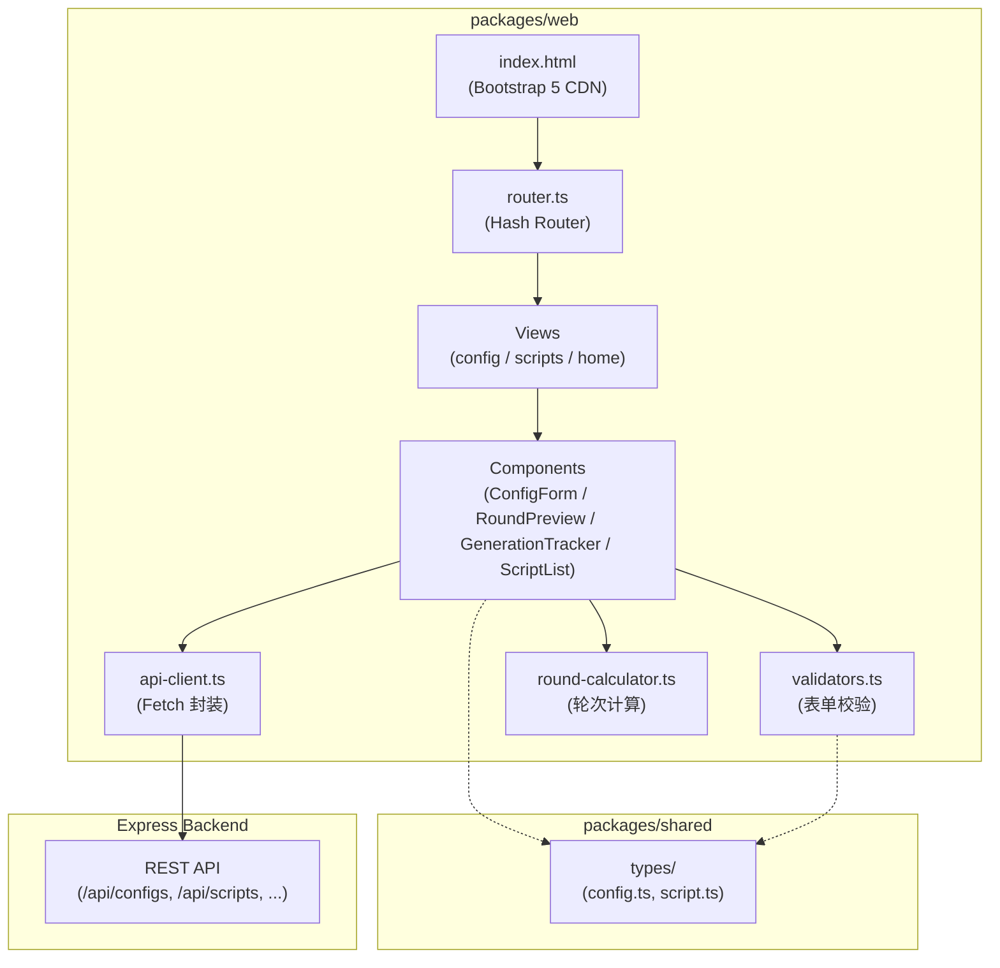

# 设计文档：Bootstrap 前端配置界面

## 概述

本设计为剧本杀 AI 生成工具构建一个基于 Bootstrap 5 的前端 Web 界面。前端作为 `packages/web` 包存在于 pnpm monorepo 中，采用 Vite + TypeScript 构建，通过 CDN 引入 Bootstrap 5，调用已有的 Express 后端 REST API。

前端采用单页面应用（SPA）架构，使用 hash 路由实现视图切换。核心功能包括：剧本配置表单、轮次结构预览、生成任务跟踪、剧本列表浏览。所有 UI 文本为中文。

### 设计决策

1. **CDN 引入 Bootstrap**：避免打包体积膨胀，利用 CDN 缓存加速加载
2. **原生 DOM 操作 + TypeScript**：不引入 React/Vue 等框架，保持轻量；TypeScript 提供类型安全
3. **Hash 路由**：无需服务端配置，适合静态部署
4. **共享类型复用**：直接引用 `packages/shared` 中的类型定义，保持前后端类型一致

## 架构

### 整体架构



### 目录结构

```
packages/web/
├── index.html              # 入口 HTML，引入 Bootstrap CDN
├── package.json
├── tsconfig.json
├── vite.config.ts
└── src/
    ├── main.ts             # 入口，初始化路由
    ├── router.ts           # Hash 路由器
    ├── api-client.ts       # API 请求封装
    ├── validators.ts       # 表单校验逻辑
    ├── round-calculator.ts # 轮次结构计算
    ├── views/
    │   ├── home.ts         # 首页视图
    │   ├── config.ts       # 配置表单视图
    │   └── scripts.ts      # 剧本列表视图
    └── components/
        ├── config-form.ts        # 配置表单组件
        ├── round-preview.ts      # 轮次预览组件
        ├── generation-tracker.ts # 生成跟踪组件
        ├── script-list.ts        # 剧本列表组件
        └── toast.ts              # Toast 通知组件
```

## 组件与接口

### 1. Hash 路由器（router.ts）

负责监听 `hashchange` 事件，根据 hash 值渲染对应视图。

```typescript
interface Route {
  path: string;           // 如 '/', '/config', '/scripts'
  render: (container: HTMLElement) => void | Promise<void>;
}

interface Router {
  register(route: Route): void;
  start(): void;
  navigate(path: string): void;
}
```

路由映射：
- `#/` → 首页视图
- `#/config` → 配置表单视图
- `#/scripts` → 剧本列表视图

### 2. API 客户端（api-client.ts）

封装 fetch API，提供统一的请求方法和错误处理。

```typescript
interface ApiClientConfig {
  baseUrl: string;
}

interface ApiClient {
  get<T>(path: string): Promise<T>;
  post<T>(path: string, body: unknown): Promise<T>;
}
```

关键行为：
- 所有请求自动拼接 `baseUrl` 前缀
- 自动设置 `Content-Type: application/json`
- 非 2xx 响应抛出包含状态码和错误信息的 `ApiError`
- 网络错误抛出 `ApiError` 并标记为网络错误

```typescript
class ApiError extends Error {
  constructor(
    message: string,
    public statusCode: number,
    public details?: unknown
  ) {
    super(message);
  }
}
```

### 3. 表单校验器（validators.ts）

纯函数模块，不依赖 DOM，接收表单数据对象返回校验结果。

```typescript
interface FieldError {
  field: string;
  message: string;  // 中文错误提示
}

interface ValidationResult {
  valid: boolean;
  errors: FieldError[];
}

function validateConfigForm(data: Partial<CreateConfigInput>): ValidationResult;
function validateSpecialSetting(data: Partial<SpecialSetting>): ValidationResult;
```

校验规则（与后端 ConfigService.validate 对齐）：
| 字段 | 规则 | 错误提示 |
|------|------|----------|
| playerCount | 1-6 整数 | "玩家人数必须为 1-6 的整数" |
| durationHours | 2-6 整数 | "游戏时长必须为 2-6 的整数" |
| gameType | 有效枚举值 | "请选择游戏类型" |
| ageGroup | 有效枚举值 | "请选择目标年龄段" |
| restorationRatio | 0-100 整数 | "还原比例必须为 0-100 的整数" |
| era | 非空字符串 | "请输入时代背景" |
| location | 非空字符串 | "请输入地点" |
| theme | 非空字符串 | "请输入主题" |
| settingTypes | 至少选一项（shin_honkaku 时） | "请至少选择一种特殊设定类型" |
| settingDescription | 非空（shin_honkaku 时） | "请输入设定描述" |

### 4. 轮次计算器（round-calculator.ts）

纯函数，根据游戏时长计算轮次结构。

```typescript
function calculateRoundStructure(durationHours: number): RoundStructure | null;
```

时长到轮次映射：
| durationHours | totalRounds |
|---------------|-------------|
| 2 | 2 |
| 3 | 3 |
| 4 | 4 |
| 5 | 4 |
| 6 | 5 |

每轮时间分配根据总可用时间（总时长减去总结、投票、揭示时间）平均分配到各轮的阅读、搜证、讨论阶段。无效输入返回 `null`。

### 5. 配置表单组件（config-form.ts）

```typescript
interface ConfigFormOptions {
  container: HTMLElement;
  apiClient: ApiClient;
  onConfigCreated: (configId: string) => void;
}

class ConfigForm {
  constructor(options: ConfigFormOptions);
  render(): void;
  destroy(): void;
}
```

关键行为：
- 渲染完整的 Bootstrap 表单到容器
- restorationRatio 滑块变化时实时更新 deductionRatio 显示
- gameType 切换到 shin_honkaku 时显示特殊设定区域，切换离开时隐藏并清空
- 提交时调用 `validateConfigForm` 校验，失败时在字段旁显示错误（`is-invalid` 类）
- 校验通过后调用 `apiClient.post('/api/configs', data)`，成功后回调 `onConfigCreated`

### 6. 轮次预览组件（round-preview.ts）

```typescript
interface RoundPreviewOptions {
  container: HTMLElement;
}

class RoundPreview {
  constructor(options: RoundPreviewOptions);
  update(durationHours: number): void;
  clear(): void;
}
```

关键行为：
- `update` 调用 `calculateRoundStructure` 获取轮次数据，渲染为 Bootstrap 表格
- 无效输入时调用 `clear` 显示占位提示文本

### 7. 生成跟踪组件（generation-tracker.ts）

```typescript
interface GenerationTrackerOptions {
  container: HTMLElement;
  apiClient: ApiClient;
}

class GenerationTracker {
  constructor(options: GenerationTrackerOptions);
  startGeneration(configId: string): Promise<void>;
  destroy(): void;
}
```

关键行为：
- 调用 `POST /api/scripts/generate` 发起生成
- 收到 202 后启动 3 秒间隔轮询 `GET /api/scripts/jobs/:jobId`
- 轮询期间显示 Bootstrap spinner 和状态文本
- 状态变为 `completed` 时停止轮询，显示成功提示和查看链接
- 状态变为 `failed` 时停止轮询，显示错误信息
- 连续 3 次请求失败时停止轮询，显示网络错误和重试按钮
- `destroy` 清理定时器

### 8. 剧本列表组件（script-list.ts）

```typescript
interface ScriptListOptions {
  container: HTMLElement;
  apiClient: ApiClient;
  pageSize: number;  // 默认 10
}

class ScriptList {
  constructor(options: ScriptListOptions);
  render(): Promise<void>;
  destroy(): void;
}
```

关键行为：
- 加载时调用 `GET /api/scripts?limit=10&offset=0`
- 以 Bootstrap 卡片列表展示，每张卡片显示标题、版本号、状态、创建时间
- 列表为空时显示"暂无剧本"占位提示
- 分页按钮控制 offset 参数实现翻页

### 9. Toast 通知组件（toast.ts）

```typescript
function showToast(message: string, type: 'success' | 'danger' | 'warning'): void;
```

使用 Bootstrap Toast API 在页面右上角显示通知，自动消失。

## 数据模型

前端直接复用 `packages/shared/src/types/` 中的类型定义：

### 核心类型引用

| 类型 | 来源 | 用途 |
|------|------|------|
| `ScriptConfig` | `config.ts` | 配置表单提交数据 |
| `CreateConfigInput` | `config.ts` | POST /api/configs 请求体 |
| `GameType` | `config.ts` | 游戏类型枚举 |
| `AgeGroup` | `config.ts` | 年龄段枚举 |
| `SettingType` | `config.ts` | 特殊设定类型枚举 |
| `SpecialSetting` | `config.ts` | 特殊设定数据 |
| `RoundStructure` | `config.ts` | 轮次结构 |
| `RoundPhase` | `config.ts` | 轮次阶段时间 |
| `Script` | `script.ts` | 剧本列表展示 |
| `ScriptStatus` | `script.ts` | 剧本状态枚举 |
| `GenerateJob` | 后端定义 | 生成任务状态（前端需定义对应接口） |

### 前端专用类型

```typescript
/** 生成任务状态（对应后端 GenerateJob） */
interface GenerateJobResponse {
  jobId: string;
  configId: string;
  status: 'pending' | 'generating' | 'completed' | 'failed';
  scriptId?: string;
  error?: string;
  createdAt: string;
  updatedAt: string;
}

/** API 错误响应 */
interface ApiErrorResponse {
  error: string;
  details?: unknown;
}

/** 分页列表响应 */
interface PaginatedResponse<T> {
  items: T[];
  total: number;
  limit: number;
  offset: number;
}
```


## 正确性属性

*正确性属性是一种在系统所有有效执行中都应成立的特征或行为——本质上是关于系统应该做什么的形式化陈述。属性作为人类可读规范与机器可验证正确性保证之间的桥梁。*

### Property 1: Base URL 拼接正确性

*For any* base URL 和任意 API 路径，API_Client 构造的请求 URL 应等于 baseUrl 与 path 的正确拼接（处理尾部斜杠），且不产生双斜杠或缺失斜杠。

**Validates: Requirements 1.6**

### Property 2: 还原比例与推理比例互补不变量

*For any* restorationRatio 值（0-100 整数），计算得到的 deductionRatio 应等于 `100 - restorationRatio`，且两者之和始终为 100。

**Validates: Requirements 2.2**

### Property 3: 表单校验正确性

*For any* 配置表单输入数据，`validateConfigForm` 应满足：
- 当所有字段均合法时返回 `{ valid: true, errors: [] }`
- 当任意字段不合法时返回 `{ valid: false }` 且 `errors` 数组中包含对应字段名和中文错误提示
- 当 gameType 为 shin_honkaku 时，额外校验 settingTypes 非空和 settingDescription 非空
- 当 gameType 不为 shin_honkaku 时，不校验 specialSetting 相关字段

**Validates: Requirements 2.3, 2.4, 3.4**

### Property 4: 轮次结构计算正确性

*For any* 有效的 durationHours（2-6 整数），`calculateRoundStructure` 应返回非 null 的 RoundStructure，其中：
- totalRounds 符合映射表（2→2, 3→3, 4→4, 5→4, 6→5）
- rounds 数组长度等于 totalRounds
- 每轮各阶段时间之和加上 summaryMinutes + finalVoteMinutes + revealMinutes 不超过 durationHours × 60 分钟

*For any* 无效的 durationHours（非 2-6 整数），`calculateRoundStructure` 应返回 null。

**Validates: Requirements 4.1, 4.3**

### Property 5: 分页偏移量计算正确性

*For any* 页码 page（正整数）和页大小 pageSize（默认 10），计算的 offset 应等于 `(page - 1) * pageSize`，且 limit 应等于 pageSize。

**Validates: Requirements 6.4**

### Property 6: 路由解析正确性

*For any* 已注册的 hash 路由路径，路由器应解析到对应的视图渲染函数。对于未注册的路径，路由器应回退到默认路由（首页）。

**Validates: Requirements 7.2**

## 错误处理

### API 错误处理策略

| 场景 | 处理方式 |
|------|----------|
| 网络不可达 | ApiClient 抛出 ApiError，前端显示 Toast "网络连接失败，请检查网络" |
| 400 校验失败 | 显示后端返回的具体错误信息 |
| 404 资源不存在 | 显示 Toast "资源不存在" |
| 500 服务器错误 | 显示 Toast "服务器错误，请稍后重试" |
| 轮询连续失败 3 次 | 停止轮询，显示网络错误提示和手动重试按钮 |

### 表单校验错误处理

- 校验失败时在对应字段添加 Bootstrap `is-invalid` CSS 类
- 在字段下方的 `<div class="invalid-feedback">` 中显示中文错误提示
- 用户修改字段值时清除该字段的错误状态
- 所有错误提示使用中文

### 生成跟踪错误处理

- 维护连续失败计数器 `consecutiveFailures`
- 每次轮询成功时重置为 0
- 每次轮询失败时递增
- 达到 3 时停止轮询，显示重试按钮
- 重试按钮点击后重置计数器并重新开始轮询

## 测试策略

### 属性测试（Property-Based Testing）

使用 **fast-check** 库进行属性测试，每个属性测试运行至少 100 次迭代。

测试覆盖的属性：

| 属性 | 测试文件 | 标签 |
|------|----------|------|
| Property 1: Base URL 拼接 | `api-client.test.ts` | Feature: bootstrap-frontend-ui, Property 1: Base URL concatenation |
| Property 2: 比例互补 | `validators.test.ts` | Feature: bootstrap-frontend-ui, Property 2: Ratio complement invariant |
| Property 3: 表单校验 | `validators.test.ts` | Feature: bootstrap-frontend-ui, Property 3: Form validation correctness |
| Property 4: 轮次计算 | `round-calculator.test.ts` | Feature: bootstrap-frontend-ui, Property 4: Round structure calculation |
| Property 5: 分页偏移量 | `script-list.test.ts` | Feature: bootstrap-frontend-ui, Property 5: Pagination offset |
| Property 6: 路由解析 | `router.test.ts` | Feature: bootstrap-frontend-ui, Property 6: Route resolution |

每个正确性属性由一个独立的属性测试实现。

### 单元测试

使用 **Vitest** 作为测试框架，覆盖以下场景：

- **validators.ts**：具体的校验边界值示例（playerCount=0, playerCount=7 等）
- **round-calculator.ts**：每个 durationHours 值的具体预期输出
- **api-client.ts**：模拟 fetch 测试各种 HTTP 状态码处理
- **generation-tracker.ts**：模拟轮询状态转换（pending→generating→completed/failed）
- **router.ts**：具体路由匹配示例

单元测试聚焦于具体示例和边界情况，属性测试覆盖通用规则，两者互补。

### 测试配置

```typescript
// vitest.config.ts
export default {
  test: {
    environment: 'jsdom',  // DOM 环境支持
    include: ['src/**/*.test.ts'],
  }
}
```
