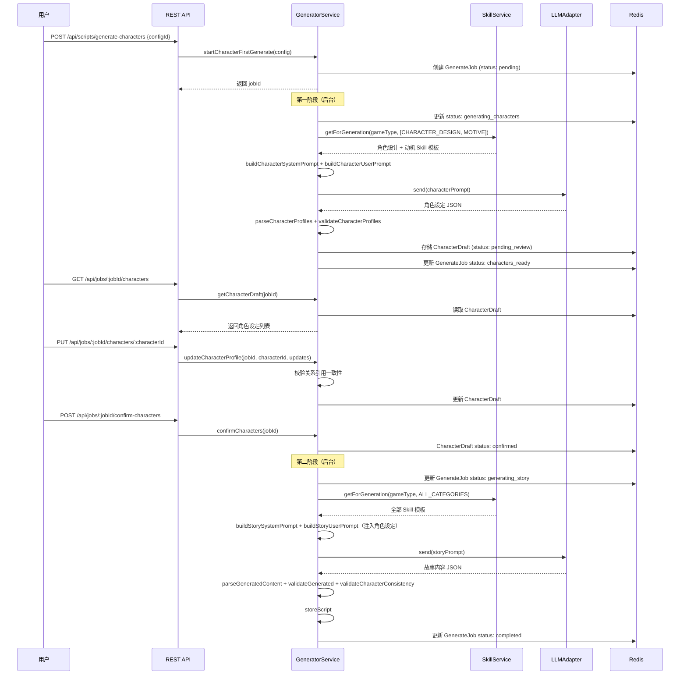
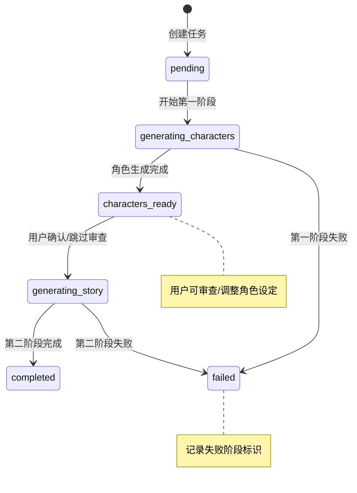

# 设计文档：角色优先两阶段生成

## 概述

本功能将现有的一次性剧本生成流程扩展为"角色优先"的两阶段生成流程。第一阶段根据 `ScriptConfig` 生成角色设定（`CharacterProfile` 列表），第二阶段基于已确认的角色设定生成完整故事内容。两阶段之间用户可审查和调整角色设定。

核心设计决策：
1. **扩展而非替换**：在现有 `GeneratorService` 上新增方法，通过 `generationMode` 参数区分一次性生成和两阶段生成，不破坏现有接口
2. **Redis 中间存储**：`CharacterDraft`（角色草稿）存储在 Redis 中，与现有 `GenerateJob` 模式一致，TTL 24小时
3. **MySQL 角色持久化**：角色基本设计（`characters` 表）和角色-剧本关系（`script_character_sets` 表）持久化到 MySQL，支持跨剧本复用。一个角色可对应多个剧本，每个剧本是角色的一段"经历"
4. **状态机扩展**：`GenerateJob` 新增 `generating_characters`、`characters_ready`、`generating_story` 三个状态
5. **分阶段提示词**：第一阶段仅注入角色设计和动机类 Skill 模板，第二阶段注入全部 Skill 模板并携带完整角色设定
6. **向后兼容**：`generationMode` 默认为 `oneshot`，现有调用方无需修改
7. **角色类型区分**：`CharacterProfile` 通过 `characterType` 字段区分玩家角色（player）和NPC角色（npc），玩家角色数量与 `playerCount` 一致，NPC数量由LLM自行决定
8. **外貌描述支持**：`CharacterProfile` 包含 `appearance` 字段，存储详细的外貌描述（体貌特征、穿着风格等），用于后续AI角色形象图片生成
9. **角色个性一致性**：`CharacterProfile` 包含 `gender`（性别）、`bloodType`（血型）、`mbtiType`（MBTI类型）字段，生成时确保角色的 personality 与 MBTI 类型、血型之间保持合理一致性

技术栈沿用现有：Node.js + Express + TypeScript, MySQL + Redis, Vitest + fast-check

## 架构

### 两阶段生成流程



### 状态机



## 组件与接口

### 1. 新增类型定义

在 `packages/shared/src/types/script.ts` 中扩展：

```typescript
// ─── 生成模式 ───

/** 生成模式 */
export type GenerationMode = 'oneshot' | 'character_first';

// ─── 角色设定 ───

/** 关系类型 */
export type RelationshipType =
  | 'ally'        // 盟友
  | 'rival'       // 对手
  | 'lover'       // 恋人
  | 'family'      // 亲属
  | 'colleague'   // 同事
  | 'stranger'    // 陌生人
  | 'enemy'       // 敌人
  | 'mentor'      // 导师/学生
  | 'suspect';    // 嫌疑关系

/** 叙事功能定位 */
export type NarrativeRole =
  | 'murderer'    // 凶手
  | 'detective'   // 侦探
  | 'witness'     // 目击者
  | 'suspect'     // 嫌疑人
  | 'victim'      // 受害者
  | 'accomplice'  // 帮凶
  | 'bystander';  // 旁观者

/** 角色关系（扩展版） */
export interface CharacterProfileRelationship {
  targetCharacterId: string;
  targetCharacterName: string;
  relationshipType: RelationshipType;
  description: string;
}

/** 血型 */
export type BloodType = 'A' | 'B' | 'O' | 'AB';

/** 角色类型 */
export type CharacterType = 'player' | 'npc';

/** 角色设定 */
export interface CharacterProfile {
  characterId: string;
  characterName: string;
  characterType: CharacterType;                   // 角色类型：玩家角色或NPC
  gender: string;                                 // 性别
  bloodType: BloodType;                           // 血型
  mbtiType: string;                               // MBTI类型（如 INTJ、ENFP 等）
  personality: string;
  appearance: string;                             // 外貌描述，用于后续角色形象图片生成
  backgroundStory: string;
  primaryMotivation: string;
  secrets: string[];                              // 至少一项
  relationships: CharacterProfileRelationship[];
  secondaryMotivations?: string[];
  specialTraits?: string[];
  narrativeRole?: NarrativeRole;
}
```

### 2. CharacterDraft 存储

在 `packages/shared/src/types/script.ts` 中新增：

```typescript
/** 角色草稿状态 */
export type CharacterDraftStatus = 'pending_review' | 'confirmed';

/** 角色草稿 */
export interface CharacterDraft {
  jobId: string;
  configId: string;
  characters: CharacterProfile[];
  status: CharacterDraftStatus;
  createdAt: string;
  updatedAt: string;
}
```

Redis 存储方案：
```
character_draft:{jobId} -> JSON(CharacterDraft)  TTL: 86400s (24h)
```

选择 Redis 而非 MySQL 的理由：
- CharacterDraft 是生成流程的中间产物，生命周期短（最长24小时）
- 与现有 GenerateJob 的 Redis 存储模式一致
- 高频读写（用户审查时多次获取和更新）
- 最终确认后角色数据会融入 Script 持久化到 MySQL

注意：CharacterDraft 中的 characters 列表包含 player 和 npc 两种类型的角色。NPC 角色不计入 playerCount，其数量由 LLM 根据故事需要自行决定。

### 3. GenerateJob 扩展

```typescript
/** 扩展后的 GenerateJob */
export interface GenerateJob {
  jobId: string;
  configId: string;
  status:
    | 'pending'
    | 'generating'              // oneshot 模式
    | 'completed'
    | 'failed'
    | 'generating_characters'   // 新增：第一阶段生成中
    | 'characters_ready'        // 新增：角色生成完成，待审查
    | 'generating_story';       // 新增：第二阶段生成中
  generationMode: GenerationMode;  // 新增
  currentPhase?: 'character' | 'story';  // 新增：当前阶段标识
  scriptId?: string;
  error?: string;
  errorPhase?: 'character' | 'story';  // 新增：失败阶段标识
  createdAt: string;
  updatedAt: string;
}
```

### 4. GeneratorService 扩展方法

在现有 `GeneratorService` 类上新增以下方法，不修改现有方法签名：

```typescript
// ─── 两阶段生成入口 ───

/** 启动角色优先两阶段生成 */
async startCharacterFirstGenerate(config: ScriptConfig): Promise<GenerateJob>;

/** 第一阶段后台执行器 */
private async runCharacterGenerate(jobId: string, config: ScriptConfig): Promise<void>;

// ─── 第一阶段：角色生成 ───

/** 生成角色设定 */
async generateCharacters(config: ScriptConfig): Promise<CharacterProfile[]>;

/** 构建角色生成系统提示词 */
buildCharacterSystemPrompt(config: ScriptConfig): string;

/** 构建角色生成用户提示词 */
buildCharacterUserPrompt(config: ScriptConfig, skills: SkillTemplate[]): string;

/** 解析角色设定 JSON */
parseCharacterProfiles(content: string): CharacterProfile[];

/** 校验角色设定（player角色数量须等于playerCount，NPC不计入） */
validateCharacterProfiles(profiles: CharacterProfile[], config: ScriptConfig): void;

// ─── 角色草稿管理 ───

/** 存储角色草稿到 Redis */
async storeCharacterDraft(jobId: string, configId: string, characters: CharacterProfile[]): Promise<CharacterDraft>;

/** 获取角色草稿 */
async getCharacterDraft(jobId: string): Promise<CharacterDraft | null>;

/** 更新单个角色设定 */
async updateCharacterProfile(jobId: string, characterId: string, updates: Partial<CharacterProfile>): Promise<CharacterDraft>;

/** 校验角色间关系引用一致性 */
validateRelationshipConsistency(characters: CharacterProfile[]): ValidationError[];

/** 确认角色设定 */
async confirmCharacters(jobId: string): Promise<void>;

// ─── 第二阶段：故事生成 ───

/** 启动第二阶段故事生成 */
async startStoryGenerate(jobId: string): Promise<void>;

/** 第二阶段后台执行器 */
private async runStoryGenerate(jobId: string): Promise<void>;

/** 基于角色设定生成故事 */
async generateStory(config: ScriptConfig, characters: CharacterProfile[], feedback?: AggregatedFeedback): Promise<Script>;

/** 构建故事生成系统提示词 */
buildStorySystemPrompt(config: ScriptConfig, characters: CharacterProfile[]): string;

/** 构建故事生成用户提示词 */
buildStoryUserPrompt(config: ScriptConfig, characters: CharacterProfile[], skills: SkillTemplate[], feedback?: AggregatedFeedback): string;

/** 校验故事与角色设定的一致性 */
validateCharacterConsistency(script: Script, characters: CharacterProfile[]): void;

// ─── 反馈优化扩展 ───

/** 基于反馈的两阶段优化 */
async optimizeWithFeedbackCharacterFirst(scriptId: string, feedback: AggregatedFeedback): Promise<Script>;

/** 构建角色优化提示词 */
buildCharacterOptimizationPrompt(characters: CharacterProfile[], feedback: AggregatedFeedback, skills: SkillTemplate[]): string;
```

### 5. 角色生成提示词设计

第一阶段 `buildCharacterSystemPrompt` 核心结构：

```
你是一位专业的剧本杀角色设计师。
根据以下配置参数，设计一组角色设定。

要求：
1. 每个角色必须有独特的性格特征和背景故事
2. 角色之间必须存在至少一组对立关系和至少一组合作关系
3. 每个角色至少有一个秘密
4. 角色动机必须与故事主题相关
5. 角色关系网络必须形成有意义的戏剧冲突
6. 必须生成恰好 {playerCount} 个 characterType 为 "player" 的玩家角色
7. 可根据故事需要额外生成若干 characterType 为 "npc" 的NPC角色（NPC不计入玩家人数）
8. 每个角色必须包含以下基础属性：
   - 性别（gender）
   - 血型（bloodType）：取值为 A、B、O 或 AB
   - MBTI类型（mbtiType）：16种MBTI类型之一（如 INTJ、ENFP、ISTP 等）
9. 角色的性格特征（personality）必须与其MBTI类型和血型保持合理一致性：
   - MBTI类型应反映角色的核心性格倾向（如 INTJ 应体现独立思考和战略规划，ENFP 应体现热情和创造力）
   - 血型可作为性格的辅助参考（如 A型偏谨慎细致，B型偏自由奔放，O型偏果断务实，AB型偏理性多面）
   - 性格描述应与MBTI和血型形成自然协调，而非机械对应
10. 每个角色必须包含详细的外貌描述（appearance），包括：
   - 体貌特征（身高、体型、发型、发色、面部特征等）
   - 穿着风格（服装、配饰、整体气质等）
   - 外貌描述应足够详细，以便后续用于AI图片生成
   外貌描述需与角色的时代背景、社会地位和性格特征相匹配

[如果 gameType === 'shin_honkaku' && specialSetting]
11. 角色设定必须与特殊世界观设定兼容
特殊设定：{specialSetting.settingDescription}
设定限制：{specialSetting.settingConstraints}
[/如果]

输出格式：JSON数组，每个元素为 CharacterProfile 结构（包含 characterType、gender、bloodType、mbtiType、appearance 字段）
```

第一阶段 `buildCharacterUserPrompt` 注入内容：
- 配置参数（playerCount, gameType, ageGroup, era, location, theme）
- CHARACTER_DESIGN 和 MOTIVE 类别的 Skill 模板
- 性别、血型、MBTI类型的生成要求及性格一致性指令

### 6. 故事生成提示词设计

第二阶段 `buildStorySystemPrompt` 核心结构：

```
你是一位专业的剧本杀故事设计师。
基于以下已确认的角色设定，生成完整的故事内容。

角色设定：
{JSON.stringify(characters)}

要求：
1. 故事必须基于已有角色设定展开，不得引入未定义的角色
2. 每个角色的背景故事、关系和动机必须与角色设定一致
3. 时间线中涉及的角色必须在角色集合中（包含 player 和 npc 角色）
4. 仅为 characterType 为 "player" 的角色生成玩家手册，NPC角色不生成玩家手册
5. 玩家手册中的角色信息必须与 CharacterProfile 一致（包括性别、MBTI类型等）
6. DM手册中应包含所有角色（player 和 npc）的信息
7. 故事中角色的行为模式应与其MBTI类型和性格特征保持一致

输出格式：与现有 Script 结构一致的 JSON
```

第二阶段 `buildStoryUserPrompt` 注入内容：
- 完整角色设定（CharacterProfile 列表）
- 原始配置参数
- 全部类别的 Skill 模板
- 反馈数据（如有）

### 7. REST API 端点

新增端点（不影响现有端点）：

```
两阶段生成:
  POST   /api/scripts/generate-characters    - 启动角色优先生成（传入 configId）
  GET    /api/jobs/:jobId                    - 查询任务状态（复用现有，扩展返回字段）
  GET    /api/jobs/:jobId/characters         - 获取角色草稿
  PUT    /api/jobs/:jobId/characters/:characterId  - 更新单个角色设定
  POST   /api/jobs/:jobId/confirm-characters - 确认角色设定，触发第二阶段
  POST   /api/jobs/:jobId/skip-review        - 跳过审查，自动进入第二阶段
```

请求/响应示例：

```typescript
// POST /api/scripts/generate-characters
// Request
{ configId: string }
// Response
{ jobId: string, status: 'pending', generationMode: 'character_first' }

// GET /api/jobs/:jobId/characters
// Response
{
  jobId: string,
  status: 'pending_review' | 'confirmed',
  characters: CharacterProfile[]  // 包含 player 和 npc 类型角色，每个角色含 gender、bloodType、mbtiType、appearance 字段
}

// PUT /api/jobs/:jobId/characters/:characterId
// Request: Partial<CharacterProfile>（不含 characterId，可更新 characterType、gender、bloodType、mbtiType、appearance 等字段）
// Response: { characters: CharacterProfile[], validationErrors?: ValidationError[] }

// POST /api/jobs/:jobId/confirm-characters
// Response: { jobId: string, status: 'generating_story' }
```

### 8. 向后兼容设计

现有 `POST /api/scripts/generate` 端点保持不变，默认 `generationMode: 'oneshot'`。

可选扩展：在现有端点中支持 `generationMode` 参数：
```typescript
// POST /api/scripts/generate
// Request
{ configId: string, generationMode?: GenerationMode }  // 默认 'oneshot'
```

当 `generationMode === 'character_first'` 时，内部转发到 `startCharacterFirstGenerate`。

两种模式产出的最终 `Script` 对象结构完全一致，下游消费方无需区分。

## 数据模型

### Redis 数据结构（新增）

```
# 角色草稿
character_draft:{jobId}  -> String JSON(CharacterDraft)  TTL: 86400s

# GenerateJob（扩展现有，新增字段）
generate_job:{jobId}     -> String JSON(GenerateJob)      TTL: 86400s
```

### MySQL 表结构

#### `characters` 表（新增）

存储角色基本设计，支持跨剧本复用：

```sql
CREATE TABLE characters (
  id          VARCHAR(36)  PRIMARY KEY,
  name        VARCHAR(100) NOT NULL,
  character_type ENUM('player', 'npc') NOT NULL DEFAULT 'player',
  gender      VARCHAR(20)  NOT NULL DEFAULT '' COMMENT '性别',
  birthday    VARCHAR(50)  NULL,
  blood_type  ENUM('A', 'B', 'O', 'AB') NULL COMMENT '血型',
  mbti_type   VARCHAR(4)   NULL COMMENT 'MBTI类型，如 INTJ、ENFP',
  personality TEXT         NOT NULL,
  abilities   TEXT         NULL,
  appearance  TEXT         NOT NULL COMMENT '外貌描述，用于角色形象图片生成',
  tags        JSON         NULL COMMENT 'JSON数组，角色标签',
  created_at  DATETIME     NOT NULL DEFAULT CURRENT_TIMESTAMP,
  updated_at  DATETIME     NOT NULL DEFAULT CURRENT_TIMESTAMP ON UPDATE CURRENT_TIMESTAMP,
  INDEX idx_characters_name (name),
  INDEX idx_characters_type (character_type)
) ENGINE=InnoDB DEFAULT CHARSET=utf8mb4;
```

#### `script_character_sets` 表（新增）

连接角色与剧本，记录角色在每个剧本中的经历：

```sql
CREATE TABLE script_character_sets (
  id                  VARCHAR(36)  PRIMARY KEY,
  character_id        VARCHAR(36)  NOT NULL,
  script_id           VARCHAR(36)  NOT NULL,
  character_type      ENUM('player', 'npc') NOT NULL DEFAULT 'player' COMMENT '角色在此剧本中的类型',
  motivation          TEXT         NULL COMMENT '角色在此剧本中的动机',
  experience_summary  TEXT         NULL COMMENT '经历概述',
  narrative_role      VARCHAR(50)  NULL COMMENT '叙事功能定位',
  secrets             JSON         NULL COMMENT '角色在此剧本中的秘密列表',
  created_at          DATETIME     NOT NULL DEFAULT CURRENT_TIMESTAMP,
  FOREIGN KEY (character_id) REFERENCES characters(id),
  INDEX idx_scs_character (character_id),
  INDEX idx_scs_script (script_id),
  UNIQUE INDEX idx_scs_char_script (character_id, script_id)
) ENGINE=InnoDB DEFAULT CHARSET=utf8mb4;
```

Script 的 `content` JSON 中可选增加 `characterProfiles` 字段，记录生成时使用的角色设定快照：

```typescript
// Script.content JSON 扩展
{
  // ...现有字段
  characterProfiles?: CharacterProfile[];  // 角色设定快照（仅 character_first 模式）
  generationMode?: GenerationMode;         // 记录生成模式
}
```


## 正确性属性

*正确性属性是系统在所有有效执行中应保持为真的特征或行为——本质上是关于系统应该做什么的形式化陈述。属性作为人类可读规范与机器可验证正确性保证之间的桥梁。*

### Property 1: CharacterProfile 结构校验

*对于任意*有效的 CharacterProfile 对象，以下条件必须全部成立：characterId 为非空字符串、characterName 为非空字符串、characterType 为 'player' 或 'npc'、gender 为非空字符串、bloodType 为 'A'、'B'、'O' 或 'AB' 之一、mbtiType 为有效的16种MBTI类型之一、personality 为非空字符串、appearance 为非空字符串（包含体貌特征和穿着风格描述）、backgroundStory 为非空字符串、primaryMotivation 为非空字符串、secrets 为非空数组（长度 ≥ 1）、relationships 为数组且每条关系包含 targetCharacterId、targetCharacterName、relationshipType（为有效枚举值）和 description。

**验证需求: 1.1, 1.2, 1.3**

### Property 2: 角色间关系引用一致性

*对于任意*包含 N 个 CharacterProfile 的集合，每个角色的 relationships 中引用的 targetCharacterId 都必须指向集合中存在的其他角色（不指向自身），且 validateRelationshipConsistency 对合法集合返回空错误列表，对包含无效引用的集合返回非空错误列表。

**验证需求: 1.4, 3.3, 3.6**

### Property 3: CharacterProfile JSON 往返一致性

*对于任意*有效的 CharacterProfile 对象（包含 characterType、gender、bloodType、mbtiType、appearance 字段），将其序列化为 JSON 字符串后再反序列化，产生的对象与原始对象在所有字段上深度等价。即 `JSON.parse(JSON.stringify(profile))` 深度等于 `profile`。

**验证需求: 1.5**

### Property 4: 玩家角色数量与配置一致

*对于任意*有效的 ScriptConfig（playerCount = N），validateCharacterProfiles 校验通过的 CharacterProfile 列表中，characterType 为 'player' 的角色数量必须等于 N。characterType 为 'npc' 的角色不计入 playerCount，其数量不受 playerCount 约束。

**验证需求: 2.4**

### Property 5: 角色关系多样性

*对于任意*通过 validateCharacterProfiles 校验的角色集合，所有角色的 relationships 中至少存在一条 relationshipType 为对立类型（rival/enemy）的关系，且至少存在一条 relationshipType 为合作类型（ally/colleague/family）的关系。

**验证需求: 2.5**

### Property 6: 第一阶段提示词完整性

*对于任意*有效的 ScriptConfig 和对应的 CHARACTER_DESIGN/MOTIVE 类别 Skill 模板列表，buildCharacterUserPrompt 生成的提示词字符串包含 config.playerCount、config.gameType、config.ageGroup、config.era、config.location、config.theme 的信息，且包含外貌描述（appearance）生成指令。当 config.gameType 为 shin_honkaku 且 config.specialSetting 存在时，提示词还包含 specialSetting.settingDescription 和 specialSetting.settingConstraints。

**验证需求: 2.2, 2.6, 2.7**

### Property 7: 第二阶段提示词完整性

*对于任意*有效的 ScriptConfig、已确认的 CharacterProfile 列表（包含 player 和 npc 类型角色）和 Skill 模板列表，buildStoryUserPrompt 生成的提示词字符串包含每个角色的 characterName、characterType、gender、bloodType、mbtiType、personality、appearance、backgroundStory、primaryMotivation，以及 config 中的所有配置参数。

**验证需求: 4.1, 4.2**

### Property 8: 故事-角色一致性

*对于任意*通过 validateCharacterConsistency 校验的 Script 和对应的 CharacterProfile 集合：(a) PlayerHandbook 仅为 characterType 为 'player' 的角色生成，不为 'npc' 角色生成玩家手册；(b) 每个 PlayerHandbook 的 characterName 和 backgroundStory 与对应 CharacterProfile 一致；(c) DMHandbook.timeline 中所有 involvedCharacterIds 都指向 CharacterProfile 集合中存在的角色（包含 player 和 npc），不引入未定义的角色。

**验证需求: 4.4, 4.5, 4.6**

### Property 9: 阶段化错误信息

*对于任意*两阶段生成过程中的 LLM 调用失败，返回的错误信息包含正确的阶段标识（第一阶段失败时 errorPhase 为 'character'，第二阶段失败时 errorPhase 为 'story'），且 GenerateJob 的 status 为 'failed'。当第二阶段失败时，已确认的 CharacterDraft 保持 confirmed 状态不变。

**验证需求: 2.8, 4.7, 5.5**

### Property 10: 状态机合法转换

*对于任意* character_first 模式的 GenerateJob，状态转换序列必须严格遵循：pending → generating_characters → characters_ready → generating_story → completed。不允许跳过中间状态，不允许从 completed 回退。CharacterDraft 的状态转换必须遵循：pending_review → confirmed，不允许从 confirmed 回退到 pending_review。

**验证需求: 5.1, 5.2, 5.3, 3.1, 3.4**

### Property 11: 任务查询包含角色数据

*对于任意*处于 characters_ready 或之后状态（generating_story、completed）的 GenerateJob，查询任务状态时返回的数据包含 currentPhase 阶段标识，且当第一阶段已完成时能通过 getCharacterDraft 获取到角色设定数据。

**验证需求: 5.4**

### Property 12: 反馈优化提示词包含低分角色维度

*对于任意* AggregatedFeedback 数据，如果角色相关维度（角色深度、角色动机合理性等）的平均评分低于 6 分，则 buildCharacterOptimizationPrompt 生成的提示词字符串包含这些低分维度作为优化重点的指令。

**验证需求: 6.2**

### Property 13: 两种模式 Script 结构一致

*对于任意*有效的 ScriptConfig，无论 generationMode 为 oneshot 还是 character_first，最终产出的 Script 对象都包含相同的必填字段集合（id、version、configId、config、title、dmHandbook、playerHandbooks、materials、branchStructure、tags、status、createdAt、updatedAt），下游消费方无需区分生成模式。

**验证需求: 7.4**

### Property 14: 角色持久化往返一致性

*对于任意*有效的 CharacterProfile（包含 characterType、gender、bloodType、mbtiType、appearance 字段），当角色设定被确认后持久化到 `characters` 表，再通过查询接口读取时，返回的角色基本设计（name、characterType、gender、bloodType、mbtiType、personality、appearance、abilities、tags）与原始数据一致。同时，该角色的经历列表中包含当前剧本的关联记录。

**验证需求: 8.3, 8.6**

### Property 15: 角色性格与MBTI/血型一致性

*对于任意*有效的 CharacterProfile，当 mbtiType 为有效的16种MBTI类型之一时，buildCharacterSystemPrompt 生成的提示词必须包含要求性格（personality）与 MBTI 类型和血型保持一致性的指令。validateCharacterProfiles 校验时，mbtiType 必须为16种有效MBTI类型之一，bloodType 必须为 'A'、'B'、'O' 或 'AB' 之一。

**验证需求: 2.6**

## 错误处理

### 第一阶段（角色生成）失败

- LLMAdapter 实施指数退避重试（最多3次），与现有行为一致
- 重试耗尽后，GenerateJob 状态更新为 `failed`，`errorPhase` 设为 `'character'`
- 错误信息包含 LLM 错误详情（statusCode、provider、retryAttempts）
- 用户可通过重新启动生成来重试

### 角色设定校验失败

- `validateCharacterProfiles` 校验失败时抛出包含具体错误列表的异常
- 校验项：角色数量、必填字段、关系引用一致性、关系多样性
- API 层返回 400 状态码和 `ValidationError[]`

### 角色修改导致关系不一致

- `updateCharacterProfile` 在更新后自动调用 `validateRelationshipConsistency`
- 如果存在不一致（如引用了已删除的角色），返回 `validationErrors` 但仍保存修改
- 用户需修复不一致后才能确认角色设定（`confirmCharacters` 会拒绝不一致的草稿）

### 第二阶段（故事生成）失败

- 与第一阶段类似的 LLM 重试机制
- 失败后 GenerateJob 状态更新为 `failed`，`errorPhase` 设为 `'story'`
- 已确认的 CharacterDraft 保持不变，允许用户重新触发第二阶段
- 用户可通过 `POST /api/jobs/:jobId/confirm-characters` 重新触发第二阶段

### 故事-角色一致性校验失败

- `validateCharacterConsistency` 检测到不一致时记录警告
- 不一致项：玩家手册角色名不匹配、时间线引用未定义角色
- 轻微不一致（如描述措辞差异）记录警告但不阻断
- 严重不一致（如引用不存在的角色）抛出异常

### Redis 数据过期

- CharacterDraft 和 GenerateJob 的 TTL 为 24 小时
- 如果用户在 24 小时后尝试操作已过期的任务，返回 404
- API 层返回友好的错误信息提示用户重新开始生成

## 测试策略

### 测试框架

- **单元测试**: Vitest
- **属性测试**: fast-check + Vitest
- **API 测试**: Supertest

### 双重测试方法

**单元测试**用于：
- 特定示例和边界情况（如 playerCount=1 时的角色关系校验）
- 错误条件（如 LLM 调用失败时的阶段化错误处理）
- 集成点（如 Redis 存储/读取 CharacterDraft）
- API 端点的请求/响应格式验证
- 状态机的非法转换拒绝

**属性测试**用于：
- 验证跨所有输入的通用属性
- 每个属性测试至少运行 100 次迭代
- 每个属性测试通过注释引用设计文档中的属性编号
- 注释格式：**Feature: character-first-generation, Property {number}: {property_text}**
- 每个正确性属性由一个独立的属性测试实现

### 属性测试库

使用 `fast-check` 库进行属性测试，配合 Vitest 测试框架。

### 测试覆盖重点

| 属性 | 测试类型 | 优先级 |
|------|----------|--------|
| P1: CharacterProfile 结构校验 | 属性测试 | 高 |
| P2: 关系引用一致性 | 属性测试 | 高 |
| P3: CharacterProfile JSON 往返 | 属性测试 | 高 |
| P4: 玩家角色数量与配置一致 | 属性测试 | 高 |
| P5: 角色关系多样性 | 属性测试 | 中 |
| P6: 第一阶段提示词完整性 | 属性测试 | 高 |
| P7: 第二阶段提示词完整性 | 属性测试 | 高 |
| P8: 故事-角色一致性 | 属性测试 | 高 |
| P9: 阶段化错误信息 | 属性测试 | 中 |
| P10: 状态机合法转换 | 属性测试 | 高 |
| P11: 任务查询包含角色数据 | 属性测试 | 中 |
| P12: 反馈优化提示词低分维度 | 属性测试 | 中 |
| P13: 两种模式 Script 结构一致 | 属性测试 | 中 |
| P14: 角色持久化往返一致性 | 属性测试 | 高 |
| P15: 角色性格与MBTI/血型一致性 | 属性测试 | 中 |

### fast-check 生成器设计

需要为属性测试创建以下自定义生成器：

```typescript
// 血型生成器
const arbBloodType = fc.constantFrom('A', 'B', 'O', 'AB') as fc.Arbitrary<BloodType>;

// MBTI类型生成器
const arbMbtiType = fc.constantFrom(
  'INTJ', 'INTP', 'ENTJ', 'ENTP',
  'INFJ', 'INFP', 'ENFJ', 'ENFP',
  'ISTJ', 'ISFJ', 'ESTJ', 'ESFJ',
  'ISTP', 'ISFP', 'ESTP', 'ESFP'
);

// CharacterProfile 生成器
const arbCharacterProfile = (existingIds: string[]) =>
  fc.record({
    characterId: fc.uuid(),
    characterName: fc.string({ minLength: 1, maxLength: 20 }),
    characterType: fc.constantFrom('player', 'npc') as fc.Arbitrary<CharacterType>,
    gender: fc.constantFrom('男', '女', '其他'),
    bloodType: arbBloodType,
    mbtiType: arbMbtiType,
    personality: fc.string({ minLength: 1, maxLength: 200 }),
    appearance: fc.string({ minLength: 10, maxLength: 300 }),  // 外貌描述，包含体貌特征和穿着风格
    backgroundStory: fc.string({ minLength: 1, maxLength: 500 }),
    primaryMotivation: fc.string({ minLength: 1, maxLength: 200 }),
    secrets: fc.array(fc.string({ minLength: 1 }), { minLength: 1, maxLength: 5 }),
    relationships: fc.array(
      fc.record({
        targetCharacterId: fc.constantFrom(...existingIds),
        targetCharacterName: fc.string({ minLength: 1 }),
        relationshipType: fc.constantFrom('ally', 'rival', 'lover', 'family', 'colleague', 'stranger', 'enemy', 'mentor', 'suspect'),
        description: fc.string({ minLength: 1 }),
      }),
    ),
    secondaryMotivations: fc.option(fc.array(fc.string({ minLength: 1 }))),
    specialTraits: fc.option(fc.array(fc.string({ minLength: 1 }))),
    narrativeRole: fc.option(fc.constantFrom('murderer', 'detective', 'witness', 'suspect', 'victim', 'accomplice', 'bystander')),
  });

// 一致性角色集合生成器（确保关系引用有效，包含 player 和 npc 类型）
const arbConsistentCharacterSet = (playerCount: number, npcCount: number) => { /* ... */ };

// ScriptConfig 生成器（复用现有）
const arbScriptConfig = fc.record({ /* ... */ });
```
