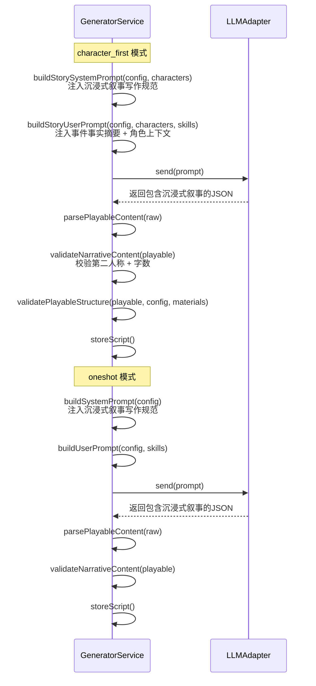
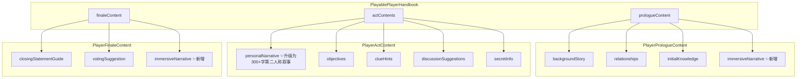
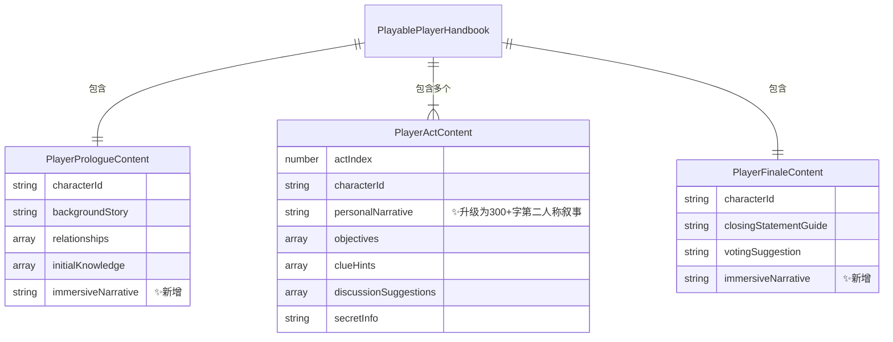

# 设计文档：角色沉浸式叙事故事生成

## 概述

本功能将剧本杀AI生成系统的玩家手册叙事内容从简短的角色视角片段升级为丰富的第二人称（"你"）沉浸式叙事。覆盖序幕（`PlayerPrologueContent.immersiveNarrative`）、每幕（`PlayerActContent.personalNarrative` 升级）和终幕（`PlayerFinaleContent.immersiveNarrative`），为每位玩家角色生成完整的沉浸式叙事体验。

核心设计决策：
1. **字段扩展而非替换**：`PlayerActContent.personalNarrative` 保持字段名不变，仅升级语义为300+字第二人称叙事；`PlayerPrologueContent` 和 `PlayerFinaleContent` 新增 `immersiveNarrative` 字段
2. **向后兼容**：旧数据中缺失 `immersiveNarrative` 字段时默认为空字符串，系统正常运行
3. **提示词驱动**：通过在现有 `buildStorySystemPrompt` / `buildStoryUserPrompt` 中注入沉浸式叙事写作规范和上下文，引导LLM直接生成符合要求的叙事内容
4. **事件事实摘要注入**：在提示词中为同一幕的所有角色注入统一的事件事实摘要（Event Fact Summary），确保跨角色叙事的客观事实一致性
5. **叙事语气匹配**：提示词中明确要求LLM根据角色的 `personality` 和 `mbtiType` 调整叙事风格
6. **生成后校验**：新增叙事校验逻辑，检查第二人称视角和字数要求
7. **双模式兼容**：`oneshot` 和 `character_first` 两种生成模式均支持沉浸式叙事生成

技术栈沿用现有：Node.js + Express + TypeScript, MySQL + Redis, Vitest + fast-check

## 架构

### 沉浸式叙事生成流程



### 叙事内容在数据结构中的位置




## 组件与接口

### 1. 类型定义变更（packages/shared/src/types/script.ts）

#### PlayerPrologueContent 扩展

```typescript
/** 玩家序幕内容 */
export interface PlayerPrologueContent {
  characterId: string;
  backgroundStory: string;
  relationships: CharacterRelationship[];
  initialKnowledge: string[];
  immersiveNarrative: string;  // 新增：序幕第二人称沉浸式叙事
}
```

#### PlayerActContent 语义升级

```typescript
/** 玩家幕内容 */
export interface PlayerActContent {
  actIndex: number;
  characterId: string;
  personalNarrative: string;     // 升级：300+字第二人称沉浸式叙事（字段名不变）
  objectives: string[];
  clueHints: string[];
  discussionSuggestions: string[];
  secretInfo: string;
}
```

字段名保持 `personalNarrative` 不变，仅升级内容语义。现有代码中读取该字段的逻辑无需修改。

#### PlayerFinaleContent 扩展

```typescript
/** 玩家终幕内容 */
export interface PlayerFinaleContent {
  characterId: string;
  closingStatementGuide: string;
  votingSuggestion: string;
  immersiveNarrative: string;  // 新增：终幕第二人称沉浸式叙事
}
```

### 2. GeneratorService 变更

#### 2.1 提示词修改（非新增方法）

在现有 `buildStorySystemPrompt` 和 `buildSystemPrompt` 方法中追加沉浸式叙事写作规范：

```typescript
// 追加到系统提示词中的沉浸式叙事规范
const narrativeRules = `
【沉浸式叙事写作规范】
1. 视角限制：所有沉浸式叙事必须以第二人称（"你"）作为叙事主语，全程使用"你"描述角色的所见所闻、行为和感受
2. 信息边界：每个角色的叙事仅包含该角色在该幕中合理可感知的信息，不泄露其他角色的秘密或未获得的线索
3. 语气匹配：根据角色的 personality 和 mbtiType 调整叙事风格：
   - 内向型角色（I开头的MBTI）：增加内心独白和观察描写比重
   - 外向型角色（E开头的MBTI）：增加互动、对话回忆和社交场景描写
4. 误导信息处理：角色持有的误导性信念以角色确信口吻呈现，不标注为误导信息
5. 凶手视角：narrativeRole 为 murderer 的角色，叙事中合理隐藏犯罪行为，提供看似合理的替代解释
6. 嫌疑人视角：narrativeRole 为 suspect 的角色，叙事中呈现可能显得可疑的情境，同时保留无辜视角
7. 字数要求：每幕的 personalNarrative 不少于300字
8. 序幕叙事：基于角色的 backgroundStory、personality、relationships 生成，融入内心独白和情感基调，以暗示方式埋入角色秘密线索
9. 终幕叙事：基于角色在前序所有幕中的经历，呈现角色对事件全貌的个人理解和面对最终审判的心理状态
10. 同一角色在序幕、各幕和终幕中的叙事语气保持一致的 NarrativeVoice，不出现风格突变
`;
```

#### 2.2 事件事实摘要注入

在 `buildStoryUserPrompt` 和 `buildUserPrompt` 中追加事件事实摘要指令：

```typescript
// 追加到用户提示词中
const narrativeContextInstruction = `
【跨角色叙事一致性要求】
请在生成每幕叙事前，先确定该幕的事件事实摘要（时间、地点、参与者、可观察行为），
然后基于该摘要为每个角色生成各自视角的叙事。不同角色对同一事件的客观要素描述必须一致，
仅在主观感受、动机推测和信息掌握程度上体现差异。

【沉浸式叙事字段说明】
- prologueContent.immersiveNarrative：序幕第二人称沉浸式叙事
- actContents[].personalNarrative：每幕第二人称沉浸式叙事（不少于300字）
- finaleContent.immersiveNarrative：终幕第二人称沉浸式叙事
`;
```

#### 2.3 JSON输出格式更新

在系统提示词的JSON输出格式模板中更新 `playerHandbooks` 部分：

```json
{
  "playerHandbooks": [{
    "characterId": "",
    "characterName": "",
    "prologueContent": {
      "characterId": "",
      "backgroundStory": "",
      "relationships": [],
      "initialKnowledge": [],
      "immersiveNarrative": "以'你'开头的序幕沉浸式叙事..."
    },
    "actContents": [{
      "actIndex": 1,
      "characterId": "",
      "personalNarrative": "以'你'开头的300+字沉浸式叙事...",
      "objectives": [],
      "clueHints": [],
      "discussionSuggestions": [],
      "secretInfo": ""
    }],
    "finaleContent": {
      "characterId": "",
      "closingStatementGuide": "",
      "votingSuggestion": "",
      "immersiveNarrative": "以'你'开头的终幕沉浸式叙事..."
    }
  }]
}
```

#### 2.4 新增叙事校验方法

```typescript
/** 校验沉浸式叙事内容 */
validateNarrativeContent(playable: PlayableStructure): void;
```

校验逻辑：
- 每个 `playerHandbook.actContents[].personalNarrative` 包含"你"且字数 ≥ 300
- 每个 `playerHandbook.prologueContent.immersiveNarrative` 包含"你"（如非空）
- 每个 `playerHandbook.finaleContent.immersiveNarrative` 包含"你"（如非空）
- 校验失败记录警告日志（与现有 `validatePlayableStructure` 行为一致，不阻断流程）

### 3. 向后兼容处理

#### 3.1 反序列化默认值

在 `deserializeScript` 方法中，对旧数据缺失的字段提供默认值：

```typescript
// 在 deserializeScript 中处理旧数据
for (const ph of playable.playerHandbooks) {
  // PlayerPrologueContent 默认 immersiveNarrative
  if (ph.prologueContent && ph.prologueContent.immersiveNarrative === undefined) {
    ph.prologueContent.immersiveNarrative = '';
  }
  // PlayerFinaleContent 默认 immersiveNarrative
  if (ph.finaleContent && ph.finaleContent.immersiveNarrative === undefined) {
    ph.finaleContent.immersiveNarrative = '';
  }
}
```

#### 3.2 迁移工具扩展

在 `MigrationService.migrateToPlayable` 中，为迁移生成的 `PlayerPrologueContent` 和 `PlayerFinaleContent` 设置 `immersiveNarrative: ''`。


## 数据模型

### 类型变更汇总

| 接口 | 变更类型 | 字段 | 说明 |
|------|----------|------|------|
| `PlayerPrologueContent` | 新增字段 | `immersiveNarrative: string` | 序幕第二人称沉浸式叙事 |
| `PlayerActContent` | 语义升级 | `personalNarrative: string` | 升级为300+字第二人称叙事，字段名不变 |
| `PlayerFinaleContent` | 新增字段 | `immersiveNarrative: string` | 终幕第二人称沉浸式叙事 |

### MySQL 变更

无需新增表或列。`immersiveNarrative` 和升级后的 `personalNarrative` 均存储在 `scripts` 表的 `content` JSON 字段中，作为 `PlayableStructure` 的子字段。

### 数据结构关系



### 向后兼容数据处理

旧版数据（不含 `immersiveNarrative` 字段）的处理策略：

```
读取旧版 PlayerPrologueContent → immersiveNarrative 默认为 ""
读取旧版 PlayerFinaleContent   → immersiveNarrative 默认为 ""
读取旧版 PlayerActContent      → personalNarrative 保持原值（短文本），无需特殊处理
```

序列化/反序列化流程：
```
Script → JSON.stringify → 存储到 MySQL content 字段
MySQL content 字段 → JSON.parse → 补充默认值 → Script 对象
```

