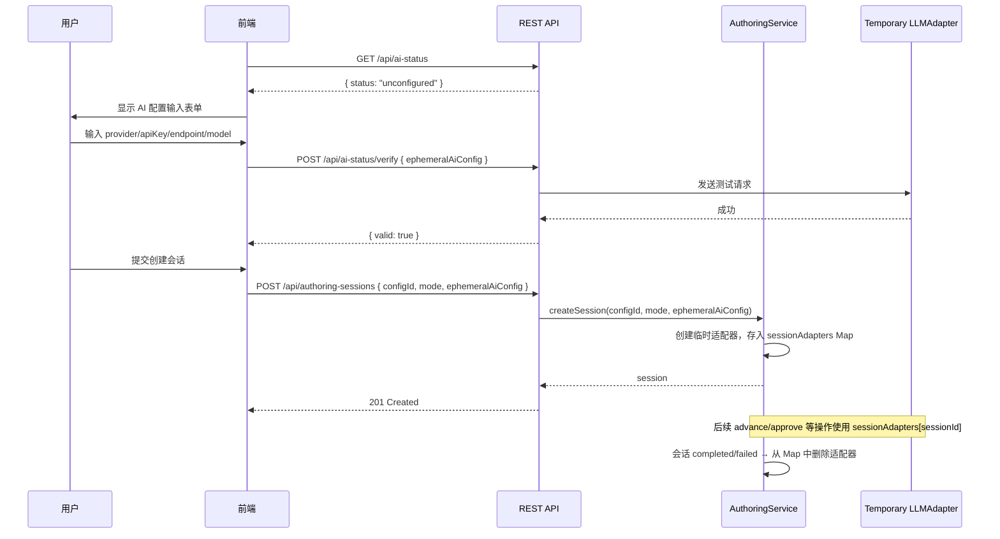
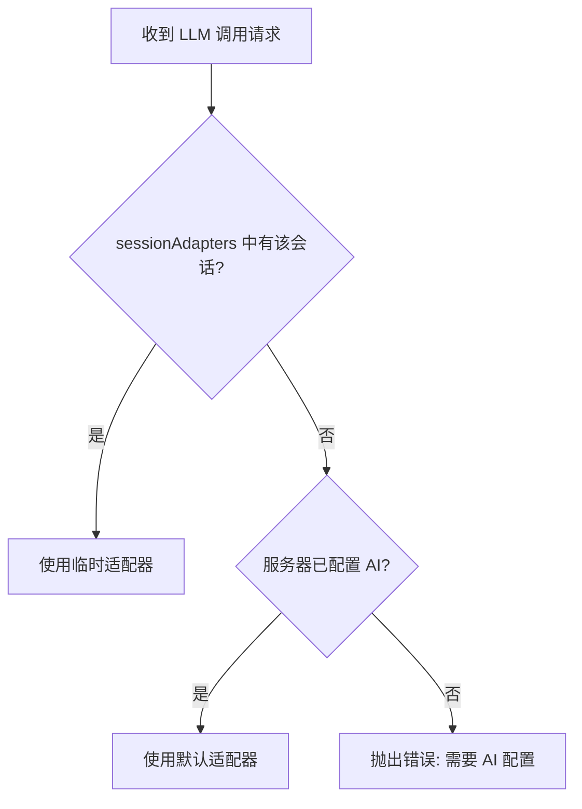

# 设计文档：临时 AI 配置（Ephemeral AI Config）

## 概述

本功能在现有 LLM 适配器体系上新增"临时 AI 配置"能力。当服务器未预配置 AI 提供商时，用户可通过前端输入临时 AI 信息（provider、apiKey、endpoint、model），该信息仅在当前创作会话生命周期内有效，不持久化到服务器。

核心设计决策：
1. **状态检测端点**：新增 `GET /api/ai-status` 端点，前端据此决定是否显示 AI 配置表单
2. **请求级传递**：临时 AI 配置通过创建会话请求体传递，不引入额外的配置存储
3. **会话级适配器缓存**：`AuthoringService` 维护一个 `sessionId → ILLMAdapter` 的内存 Map，会话结束后清除
4. **安全隔离**：apiKey 仅存在于内存中的适配器实例，数据库中仅保存 provider/model 元信息用于展示
5. **连通性预验证**：创建会话前通过轻量级测试请求验证配置有效性

## 架构

### 临时 AI 配置流程



### 适配器选择逻辑



## 组件与接口

### 1. AI 状态检测服务

```typescript
// packages/server/src/services/ai-status.service.ts

interface AiStatusResult {
  status: 'configured' | 'unconfigured';
  provider?: string;
  model?: string;
}

interface AiVerifyResult {
  valid: boolean;
  provider?: string;
  model?: string;
  error?: string;
}

class AiStatusService {
  /**
   * 检测服务器 AI 配置状态。
   * 检查 config/llm-routing.json 和环境变量 LLM_API_KEY。
   */
  getStatus(): AiStatusResult;

  /**
   * 验证临时 AI 配置的连通性。
   * 创建临时适配器，发送轻量级测试请求。
   */
  async verify(config: EphemeralAiConfig): Promise<AiVerifyResult>;
}
```

### 2. AI 状态 API 路由

```typescript
// packages/server/src/routes/ai-status.ts

// GET  /api/ai-status          → 返回 AI 配置状态
// POST /api/ai-status/verify   → 验证临时 AI 配置连通性
```

### 3. AuthoringService 扩展

在现有 `AuthoringService` 中新增会话级适配器管理：

```typescript
// packages/server/src/services/authoring/authoring.service.ts（修改）

class AuthoringService {
  // 新增：会话级临时适配器缓存
  private sessionAdapters: Map<string, ILLMAdapter> = new Map();

  /**
   * 创建会话时，若提供了 ephemeralAiConfig，创建临时适配器并缓存。
   */
  async createSession(
    configId: string,
    mode: AuthoringMode,
    ephemeralAiConfig?: EphemeralAiConfig,
  ): Promise<AuthoringSession>;

  /**
   * 获取会话对应的 LLM 适配器。
   * 优先使用 sessionAdapters 中的临时适配器，否则使用默认适配器。
   */
  private getAdapterForSession(sessionId: string): ILLMAdapter;

  /**
   * 会话完成或失败时，清除临时适配器。
   */
  private cleanupSessionAdapter(sessionId: string): void;
}
```

### 4. Authoring 路由扩展

```typescript
// packages/server/src/routes/authoring.ts（修改）

// POST /api/authoring-sessions 请求体新增可选字段 ephemeralAiConfig
// 路由层将 ephemeralAiConfig 传递给 AuthoringService.createSession()
```

### 5. 前端 AI 配置表单组件

```typescript
// packages/web/src/components/ai-config-form.ts

interface AiConfigFormOptions {
  container: HTMLElement;
  onConfigReady: (config: EphemeralAiConfig | null) => void;
  apiClient: ApiClient;
}

class AiConfigForm {
  render(): void;
  destroy(): void;
  getConfig(): EphemeralAiConfig | null;
  validate(): boolean;
}
```

### 6. Provider 默认值映射

```typescript
// packages/shared/src/types/ai-config.ts

const PROVIDER_DEFAULTS: Record<string, { endpoint: string; model: string }> = {
  openai: {
    endpoint: 'https://api.openai.com/v1/chat/completions',
    model: 'gpt-4',
  },
  anthropic: {
    endpoint: 'https://api.anthropic.com/v1/messages',
    model: 'claude-3-sonnet',
  },
  doubao: {
    endpoint: 'https://ark.cn-beijing.volces.com/api/v3/chat/completions',
    model: 'doubao-seed-1-8-251228',
  },
  custom: {
    endpoint: '',
    model: '',
  },
};
```

## 数据模型

### 新增 TypeScript 类型

```typescript
// packages/shared/src/types/ai-config.ts

/** 临时 AI 配置（用户通过前端输入） */
export interface EphemeralAiConfig {
  provider: string;
  apiKey: string;
  endpoint: string;
  model: string;
}

/** AI 配置状态 */
export interface AiStatusResult {
  status: 'configured' | 'unconfigured';
  provider?: string;
  model?: string;
}

/** AI 配置验证结果 */
export interface AiVerifyResult {
  valid: boolean;
  provider?: string;
  model?: string;
  error?: string;
}

/** 会话中保存的 AI 配置元信息（不含 apiKey） */
export interface AiConfigMeta {
  provider: string;
  model: string;
}
```

### AuthoringSession 扩展

```typescript
// packages/shared/src/types/authoring.ts（修改）

interface AuthoringSession {
  // ... 现有字段 ...
  aiConfigMeta?: AiConfigMeta;  // 新增：临时 AI 配置元信息（不含 apiKey）
}
```

### 数据库变更

`authoring_sessions` 表新增列：

```sql
ALTER TABLE authoring_sessions
  ADD COLUMN ai_config_meta JSON DEFAULT NULL;
```

`ai_config_meta` 仅存储 `{ "provider": "...", "model": "..." }`，不包含 apiKey。

## 正确性属性

### Property 1: 临时 AI 配置校验正确性
*对于任意* `EphemeralAiConfig` 对象，校验函数返回错误当且仅当以下条件之一成立：apiKey 为空字符串、endpoint 不是有效 URL 格式、model 为空字符串。校验通过当且仅当所有三个条件均不成立。

**验证需求: 2.5**

### Property 2: apiKey 不出现在序列化输出中
*对于任意*包含 `ephemeralAiConfig` 的 `AuthoringSession`，将其序列化为 JSON（用于数据库存储或 API 响应）后，输出字符串中不包含原始 apiKey 值，且 `aiConfigMeta` 仅包含 provider 和 model 字段。

**验证需求: 4.1, 4.3, 4.4**

### Property 3: 适配器选择一致性
*对于任意*会话 ID，若 `sessionAdapters` Map 中存在该 ID 的条目，则 `getAdapterForSession` 返回该临时适配器；若不存在且服务器已配置 AI，则返回默认适配器；若不存在且服务器未配置 AI，则抛出错误。三种情况互斥且完备。

**验证需求: 3.2, 3.3, 3.4**

### Property 4: Provider 默认值完整性
*对于任意*已知 provider 名称（openai、anthropic、doubao），`PROVIDER_DEFAULTS` 映射返回的对象包含非空的 endpoint 和非空的 model。对于 `custom` provider，endpoint 和 model 为空字符串。

**验证需求: 2.3**

## 错误处理

| 场景 | 处理方式 | 需求 |
|------|---------|------|
| 服务器未配置 AI 且请求无 ephemeralAiConfig | 返回 400，提示需要提供 AI 配置 | 3.4 |
| ephemeralAiConfig 校验失败 | 返回 400，包含具体字段错误 | 2.5 |
| 临时适配器连通性验证失败 | 返回 `{ valid: false, error }` | 5.4 |
| 会话进行中临时适配器 LLM 调用失败 | 走现有 failed 状态流程，同时清理适配器 | 4.2 |
| 会话 ID 在 sessionAdapters 中不存在且服务器无配置 | 抛出错误，会话转 failed | 3.4 |

## 测试策略

### 测试框架
- 单元测试：Vitest
- 属性测试：fast-check + Vitest
- API 测试：Supertest

### 双重测试方法

**单元测试**用于：
- `GET /api/ai-status` 端点在有/无配置时的响应
- `POST /api/ai-status/verify` 端点的成功/失败场景
- `POST /api/authoring-sessions` 带/不带 ephemeralAiConfig 的行为
- 会话完成后适配器清理
- 前端 provider 默认值填充

**属性测试**用于：
- 验证跨所有输入的通用属性
- 每个属性测试至少运行 100 次迭代
- 注释格式：**Feature: ephemeral-ai-config, Property {number}: {property_text}**

### 属性测试库
使用 `fast-check` 库进行属性测试，配合 Vitest 测试框架。

### 测试覆盖重点

| 属性 | 测试类型 | 优先级 |
|------|----------|--------|
| P1: 临时 AI 配置校验正确性 | 属性测试 | 高 |
| P2: apiKey 不出现在序列化输出中 | 属性测试 | 高 |
| P3: 适配器选择一致性 | 属性测试 | 高 |
| P4: Provider 默认值完整性 | 属性测试 | 中 |
