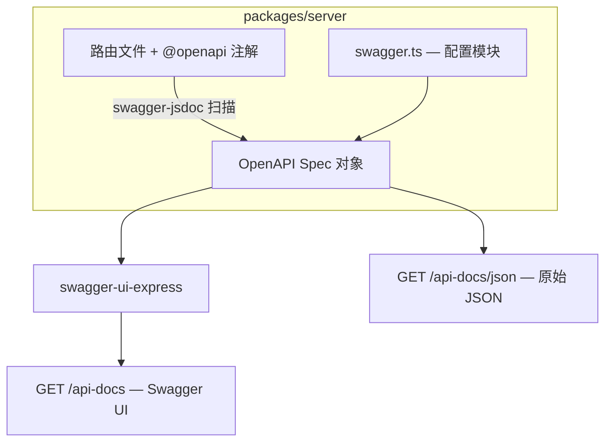

# 设计文档：OpenAPI 3.0 集成

## 概述

为谋杀悬疑剧本生成器的 Express 后端集成 OpenAPI 3.0 规范文档和 Swagger UI。采用 `swagger-jsdoc` + `swagger-ui-express` 方案，通过在路由文件中添加 `@openapi` JSDoc 注解来定义 API 规范，启动时自动扫描并合并生成完整的 OpenAPI 3.0 文档，同时在 `/api-docs` 路径提供 Swagger UI 交互界面。

## 架构



### 技术选型

| 库 | 用途 | 理由 |
|---|---|---|
| `swagger-jsdoc` | 从 JSDoc 注解生成 OpenAPI spec | 注解与代码同源，维护成本低 |
| `swagger-ui-express` | 提供 Swagger UI 中间件 | Express 生态标准方案，零配置 |

### 集成流程

1. 创建 `packages/server/src/swagger.ts` 配置模块，定义 OpenAPI 基础信息和扫描路径
2. 在每个路由文件中添加 `@openapi` JSDoc 注解
3. 在 `app.ts` 中注册 Swagger UI 中间件和 JSON 端点

## 组件与接口

### 1. Swagger 配置模块 (`packages/server/src/swagger.ts`)

负责初始化 swagger-jsdoc，导出生成的 OpenAPI spec 对象。

```typescript
import swaggerJsdoc from 'swagger-jsdoc';

const options: swaggerJsdoc.Options = {
  definition: {
    openapi: '3.0.0',
    info: {
      title: '剧本杀创作工坊 API',
      version: '1.0.0',
      description: '谋杀悬疑剧本生成器后端 API 文档',
    },
    servers: [
      { url: 'http://localhost:3000', description: '本地开发服务器' },
    ],
    tags: [
      { name: '配置管理', description: '剧本生成参数配置' },
      { name: '剧本管理', description: '剧本生成、查询与优化' },
      { name: '标签管理', description: '标签查询与管理' },
      { name: '创作会话', description: '分阶段创作工作流' },
      { name: 'AI 状态', description: 'AI 配置状态检测与验证' },
      { name: '系统', description: '健康检查等系统端点' },
    ],
  },
  apis: ['./src/routes/*.ts', './src/app.ts'],
};

export const swaggerSpec = swaggerJsdoc(options);
```

### 2. App 集成 (`packages/server/src/app.ts` 修改)

在现有 app.ts 中添加 Swagger UI 中间件：

```typescript
import swaggerUi from 'swagger-ui-express';
import { swaggerSpec } from './swagger';

// Swagger UI（放在业务路由之前）
app.use('/api-docs', swaggerUi.serve, swaggerUi.setup(swaggerSpec));
app.get('/api-docs/json', (_req, res) => res.json(swaggerSpec));
```

### 3. 路由注解格式

每个路由端点使用 `@openapi` 注解块。示例：

```typescript
/**
 * @openapi
 * /api/configs:
 *   post:
 *     tags: [配置管理]
 *     summary: 创建剧本配置
 *     requestBody:
 *       required: true
 *       content:
 *         application/json:
 *           schema:
 *             $ref: '#/components/schemas/CreateConfigRequest'
 *     responses:
 *       201:
 *         description: 配置创建成功
 *         content:
 *           application/json:
 *             schema:
 *               $ref: '#/components/schemas/ScriptConfig'
 *       400:
 *         description: 请求参数验证失败
 *         content:
 *           application/json:
 *             schema:
 *               $ref: '#/components/schemas/ErrorResponse'
 */
```

### 4. 需要注解的端点清单

| 路由文件 | 端点 | 方法 | Tag |
|---|---|---|---|
| configs.ts | /api/configs | POST | 配置管理 |
| configs.ts | /api/configs/:id | GET | 配置管理 |
| scripts.ts | /api/scripts/generate | POST | 剧本管理 |
| scripts.ts | /api/scripts/jobs/:jobId | GET | 剧本管理 |
| scripts.ts | /api/scripts | GET | 剧本管理 |
| scripts.ts | /api/scripts/:id | GET | 剧本管理 |
| scripts.ts | /api/scripts/:id/versions | GET | 剧本管理 |
| scripts.ts | /api/scripts/:id/optimize | POST | 剧本管理 |
| tags.ts | /api/tags | GET | 标签管理 |
| tags.ts | /api/tags/popular | GET | 标签管理 |
| tags.ts | /api/scripts/:id/tags | POST | 标签管理 |
| tags.ts | /api/scripts/:id/tags/:tagId | DELETE | 标签管理 |
| authoring.ts | /api/authoring-sessions | POST | 创作会话 |
| authoring.ts | /api/authoring-sessions | GET | 创作会话 |
| authoring.ts | /api/authoring-sessions/:id | GET | 创作会话 |
| authoring.ts | /api/authoring-sessions/:id/advance | POST | 创作会话 |
| authoring.ts | /api/authoring-sessions/:id/phases/:phase/edit | PUT | 创作会话 |
| authoring.ts | /api/authoring-sessions/:id/phases/:phase/approve | POST | 创作会话 |
| authoring.ts | /api/authoring-sessions/:id/chapters/:chapterIndex/regenerate | POST | 创作会话 |
| authoring.ts | /api/authoring-sessions/:id/retry | POST | 创作会话 |
| authoring.ts | /api/authoring-sessions/:id/assemble | POST | 创作会话 |
| ai-status.ts | /api/ai-status | GET | AI 状态 |
| ai-status.ts | /api/ai-status/verify | POST | AI 状态 |
| app.ts | /health | GET | 系统 |


## 数据模型

### OpenAPI Schema 定义

所有 Schema 定义在路由文件的 `@openapi` 注解中，通过 `components/schemas` 引用。Schema 需与 `packages/shared/src/types/` 中的 TypeScript 类型保持一致。

#### 核心 Schema 列表

| Schema 名称 | 对应 TypeScript 类型 | 来源文件 |
|---|---|---|
| ScriptConfig | ScriptConfig | shared/types/config.ts |
| CreateConfigRequest | Omit<ScriptConfig, 'id'> | — |
| ScriptPlan | ScriptPlan | shared/types/authoring.ts |
| ScriptOutline | ScriptOutline | shared/types/authoring.ts |
| Chapter | Chapter | shared/types/authoring.ts |
| AuthoringSession | AuthoringSession | shared/types/authoring.ts |
| CreateSessionRequest | { configId, mode, ephemeralAiConfig? } | — |
| EphemeralAiConfig | EphemeralAiConfig | shared/types/ai-config.ts |
| AiStatusResult | AiStatusResult | shared/types/ai-config.ts |
| AiVerifyResult | AiVerifyResult | shared/types/ai-config.ts |
| ErrorResponse | { error: string, details?: string[] } | — |

#### 枚举 Schema

| Schema 名称 | 枚举值来源 |
|---|---|
| ScriptStyle | config.ts — ScriptStyle enum |
| GameType | config.ts — GameType enum |
| AgeGroup | config.ts — AgeGroup enum |
| SettingType | config.ts — SettingType enum |
| AuthoringMode | authoring.ts — 'staged' \| 'vibe' |
| SessionState | authoring.ts — 联合类型 |
| PhaseName | authoring.ts — 'plan' \| 'outline' \| 'chapter' |
| ChapterType | authoring.ts — 联合类型 |

#### Schema 定义方式

Schema 通过 `@openapi` 注解在独立的 JSDoc 块中定义，放在 `swagger.ts` 或各路由文件顶部：

```yaml
/**
 * @openapi
 * components:
 *   schemas:
 *     ErrorResponse:
 *       type: object
 *       required: [error]
 *       properties:
 *         error:
 *           type: string
 *           description: 错误信息
 *         details:
 *           type: array
 *           items:
 *             type: string
 *           description: 详细错误列表
 *     ScriptStyle:
 *       type: string
 *       enum: [detective, drama, discover, destiny, dream, dimension, death]
 *       description: 剧本风格
 */
```

### Schema 与 TypeScript 类型一致性策略

- 字段名称：OpenAPI Schema 的 `properties` 键名必须与 TypeScript 接口的属性名完全一致
- 类型映射：`string` → `string`，`number` → `number`/`integer`，`boolean` → `boolean`，`Date` → `string` (format: date-time)，`unknown` → `object`
- 可选字段：TypeScript 中标记 `?` 的字段不出现在 OpenAPI 的 `required` 数组中
- 枚举值：TypeScript enum 的所有值必须在 OpenAPI `enum` 数组中列出


## 正确性属性

*属性（Property）是在系统所有合法执行中都应成立的特征或行为——本质上是对系统应做之事的形式化陈述。属性是人类可读规范与机器可验证正确性保证之间的桥梁。*

### Property 1: 路径操作完整性

*对于* OpenAPI Spec 中的每一个路径操作（path operation），该操作必须包含 `responses` 对象；若 HTTP 方法为 POST 或 PUT，则还必须包含 `requestBody` 定义。

**Validates: Requirements 1.2**

### Property 2: 中文描述一致性

*对于* OpenAPI Spec 中所有 `description` 和 `summary` 字段，其内容必须包含至少一个中文字符（Unicode 范围 \u4e00-\u9fff）。

**Validates: Requirements 1.4, 5.3**

### Property 3: JSON 序列化往返一致性

*对于* 生成的 OpenAPI Spec 对象，将其序列化为 JSON 字符串后再解析回对象，结果必须与原始对象深度相等。

**Validates: Requirements 1.5**

### Property 4: 操作标签分组

*对于* OpenAPI Spec 中的每一个路径操作，该操作必须包含非空的 `tags` 数组。

**Validates: Requirements 2.4**

### Property 5: 枚举值一致性

*对于* 每一个对应 TypeScript 枚举的 OpenAPI Schema（ScriptStyle、GameType、AgeGroup、SettingType、AuthoringMode、SessionState、PhaseName、ChapterType），其 `enum` 数组必须包含 TypeScript 枚举的所有值，且不包含额外值。

**Validates: Requirements 4.2**

### Property 6: 错误响应规范性

*对于* OpenAPI Spec 中的每一个路径操作，其 `responses` 对象必须包含 `500` 状态码；对于包含请求体验证的操作还必须包含 `400` 状态码；所有 4xx 和 5xx 响应必须引用 `ErrorResponse` Schema。

**Validates: Requirements 5.1, 5.2**

## 错误处理

| 场景 | 处理方式 |
|---|---|
| swagger-jsdoc 解析注解失败 | 启动时抛出错误，阻止服务启动（fail-fast） |
| 注解 YAML 语法错误 | swagger-jsdoc 会在启动时报告具体文件和行号 |
| Swagger UI 加载失败 | swagger-ui-express 返回 500，不影响业务 API |
| /api-docs/json 请求失败 | 返回 500 + ErrorResponse |

## 测试策略

### 属性测试（Property-Based Testing）

使用 `fast-check`（项目已有依赖）进行属性测试，每个属性至少运行 100 次迭代。

每个正确性属性对应一个独立的属性测试：

- **Property 1**: 遍历 spec.paths 中所有操作，验证 responses 和 requestBody 存在性
- **Property 2**: 递归收集所有 description/summary 字段，验证包含中文字符
- **Property 3**: `JSON.parse(JSON.stringify(spec))` 深度比较
- **Property 4**: 遍历所有操作，验证 tags 数组非空
- **Property 5**: 导入 TypeScript 枚举，与 spec 中对应 schema 的 enum 数组比较
- **Property 6**: 遍历所有操作，验证错误响应状态码和 Schema 引用

测试标签格式：`Feature: openapi-integration, Property N: {property_text}`

### 单元测试

- 验证 swaggerSpec 对象非空且包含 openapi、info、paths 字段
- 验证 /api-docs 返回 200 + HTML
- 验证 /api-docs/json 返回 200 + JSON
- 验证所有预期路径存在于 spec.paths 中
- 验证所有预期 Schema 存在于 spec.components.schemas 中

### 测试文件

- `packages/server/src/swagger.test.ts` — 属性测试 + 单元测试
