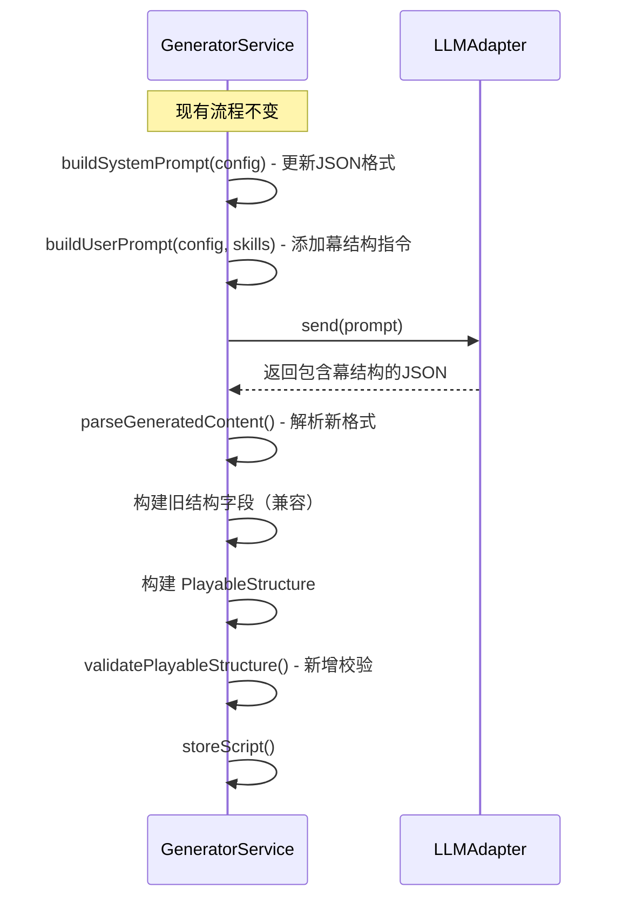
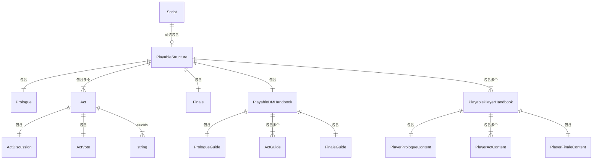

# 设计文档：可游玩结构（Playable Structure）

## 概述

本设计将剧本杀AI生成系统的输出从扁平的"轮次指引+行动指引"重组为以"幕"（Act）为核心的线性可游玩结构。每幕包含完整的游玩序列：故事叙述 → 搜证目标 → 交流建议 → 投票/决策。

核心设计决策：
1. **增量式扩展**：在现有 `Script` 类型上新增可选的 `playableStructure` 字段，而非替换现有结构，确保向后兼容
2. **幕-轮次映射**：中间幕数量直接等于 `roundStructure.totalRounds`，复用现有轮次时间配置
3. **双视角幕结构**：DM手册和玩家手册各自按幕组织，DM侧包含全局信息和主持指引，玩家侧包含角色视角的个人叙述
4. **提示词驱动**：通过修改LLM提示词模板的JSON输出格式，让AI直接生成幕结构内容
5. **迁移工具**：提供旧版数据到新结构的映射函数，不修改原始数据

技术栈沿用现有：TypeScript, Node.js, Express, Vitest + fast-check, MySQL + Redis。

## 架构

### 幕结构在系统中的位置

```mermaid
graph TB
    subgraph Script["Script（剧本）"]
        DM[DMHandbook - 旧结构]
        PH[PlayerHandbook[] - 旧结构]
        MAT[Material[]]
        BS[BranchStructure]
        PS[PlayableStructure - 新增]
    end

    subgraph PlayableStructure["PlayableStructure"]
        PRO[Prologue 序幕]
        ACT1[Act 1: 故事→目标→交流→投票]
        ACT2[Act 2: 故事→目标→交流→投票]
        ACTN[Act N: ...]
        FIN[Finale 终幕]
    end

    subgraph ActDetail["每幕内部结构"]
        DMA[DM幕指引 ActGuide]
        PHA[玩家幕内容 ActContent[]]
        CLUE[线索分发 clueIds]
        DISC[交流建议 discussion]
        VOTE[投票 vote]
    end

    PS --> PRO
    PS --> ACT1
    PS --> ACT2
    PS --> ACTN
    PS --> FIN

    ACT1 --> DMA
    ACT1 --> PHA
    ACT1 --> CLUE
    ACT1 --> DISC
    ACT1 --> VOTE
```

### 生成流程变更



## 组件与接口

### 1. 新增类型定义（packages/shared/src/types/script.ts）

```typescript
// ─── 交流建议 ───
interface ActDiscussion {
  topics: string[];              // 讨论话题列表
  guidingQuestions: string[];    // 引导问题
  suggestedMinutes: number;      // 建议讨论时长
}

// ─── 幕投票 ───
interface ActVote {
  question: string;              // 投票问题
  options: ActVoteOption[];      // 选项列表
}

interface ActVoteOption {
  id: string;
  text: string;                  // 选项文本
  impact: string;                // 对后续剧情的影响描述
  nextNodeId?: string;           // 关联分支节点（可选，与BranchStructure联动）
}

// ─── 序幕 ───
interface Prologue {
  backgroundNarrative: string;   // 故事背景叙述
  worldSetting: string;          // 世界观描述
  characterIntros: CharacterIntro[];
}

interface CharacterIntro {
  characterId: string;
  characterName: string;
  publicDescription: string;     // 公开的角色简介
}

// ─── 幕（Act）───
interface Act {
  actIndex: number;              // 从1开始
  title: string;
  narrative: string;             // 全局故事叙述（DM朗读）
  objectives: string[];          // 搜证目标
  clueIds: string[];             // 本幕分发的线索ID
  discussion: ActDiscussion;     // 交流建议
  vote: ActVote;                 // 投票/决策
}

// ─── 终幕 ───
interface Finale {
  finalVote: ActVote;            // 最终投票（如凶手指认）
  truthReveal: string;           // 真相揭示文本
  endings: FinaleEnding[];
}

interface FinaleEnding {
  endingId: string;
  name: string;
  triggerCondition: string;
  narrative: string;
  playerEndingSummaries: { characterId: string; ending: string }[];
}

// ─── DM幕指引 ───
interface ActGuide {
  actIndex: number;
  readAloudText: string;         // DM朗读文本
  keyEventHints: string[];       // 关键事件提示
  clueDistributionInstructions: ClueDistributionInstruction[];
  discussionGuidance: string;    // 交流环节引导
  voteHostingNotes: string;      // 投票主持说明
  dmPrivateNotes: string;        // DM私密备注
}

interface ClueDistributionInstruction {
  clueId: string;
  targetCharacterId: string;
  condition: string;             // 分发条件
}

interface PrologueGuide {
  openingScript: string;         // 开场白文本
  characterAssignmentNotes: string;
  rulesIntroduction: string;
}

interface FinaleGuide {
  finalVoteHostingFlow: string;
  truthRevealScript: string;     // 真相揭示朗读文本
  endingJudgmentNotes: string;   // 结局判定说明
}

// ─── 玩家幕内容 ───
interface PlayerActContent {
  actIndex: number;
  characterId: string;
  personalNarrative: string;     // 角色视角故事片段
  objectives: string[];          // 本幕行动目标
  clueHints: string[];           // 线索提示
  discussionSuggestions: string[]; // 交流建议
  secretInfo: string;            // 本幕私密信息
}

interface PlayerPrologueContent {
  characterId: string;
  backgroundStory: string;
  relationships: CharacterRelationship[];
  initialKnowledge: string[];    // 初始已知信息
}

interface PlayerFinaleContent {
  characterId: string;
  closingStatementGuide: string; // 最终陈述指引
  votingSuggestion: string;      // 投票建议
}

// ─── DM可游玩手册 ───
interface PlayableDMHandbook {
  prologueGuide: PrologueGuide;
  actGuides: ActGuide[];
  finaleGuide: FinaleGuide;
}

// ─── 玩家可游玩手册 ───
interface PlayablePlayerHandbook {
  characterId: string;
  characterName: string;
  prologueContent: PlayerPrologueContent;
  actContents: PlayerActContent[];
  finaleContent: PlayerFinaleContent;
}

// ─── 可游玩结构（顶层） ───
interface PlayableStructure {
  prologue: Prologue;
  acts: Act[];
  finale: Finale;
  dmHandbook: PlayableDMHandbook;
  playerHandbooks: PlayablePlayerHandbook[];
}
```

### 2. Script类型扩展

```typescript
// 在现有 Script interface 中新增可选字段
interface Script {
  // ... 现有字段保持不变 ...
  playableStructure?: PlayableStructure;  // 新增：可游玩结构
}
```

### 3. GeneratorService 变更

```typescript
// 新增方法
interface IGeneratorService {
  // ... 现有方法保持不变 ...

  /** 构建包含幕结构的系统提示词 */
  buildPlayableSystemPrompt(config: ScriptConfig): string;

  /** 构建包含幕结构指令的用户提示词 */
  buildPlayableUserPrompt(config: ScriptConfig, skills: SkillTemplate[], feedback?: AggregatedFeedback): string;

  /** 解析LLM返回的幕结构内容 */
  parsePlayableContent(content: string): PlayableStructure;

  /** 校验幕结构完整性 */
  validatePlayableStructure(playable: PlayableStructure, config: ScriptConfig, materials: Material[]): void;
}
```

### 4. 迁移工具

```typescript
// packages/server/src/services/migration.service.ts
interface IMigrationService {
  /** 将旧版Script转换为包含PlayableStructure的新版 */
  migrateToPlayable(script: Script): PlayableStructure;

  /** 检查Script是否已有PlayableStructure */
  hasPlayableStructure(script: Script): boolean;
}
```

迁移映射规则：
- `dmHandbook.overview` → `prologue.backgroundNarrative`
- `dmHandbook.characters` → `prologue.characterIntros`
- `dmHandbook.roundGuides[i]` → `actGuides[i]`（objectives→readAloudText, keyEvents→keyEventHints, dmNotes→dmPrivateNotes）
- `dmHandbook.branchDecisionPoints` → 按 `roundIndex` 映射到对应 `acts[i].vote`
- `dmHandbook.clueDistribution` → 按 `roundIndex` 分组到对应 `acts[i].clueIds` 和 `actGuides[i].clueDistributionInstructions`
- `playerHandbook.backgroundStory` → `playerPrologueContent.backgroundStory`
- `playerHandbook.relationships` → `playerPrologueContent.relationships`
- `playerHandbook.roundActions[i]` → `playerActContents[i]`（instructions→personalNarrative, hints→clueHints）
- `dmHandbook.truthReveal` → `finale.truthReveal`
- `dmHandbook.endings` → `finale.endings`
- `dmHandbook.judgingRules` → `finaleGuide.endingJudgmentNotes`

## 数据模型

### MySQL 变更

无需新增表。`PlayableStructure` 存储在现有 `scripts` 表的 `content` JSON 字段中，作为 JSON 对象的一个子字段。

```sql
-- 现有 scripts 表的 content 字段结构变更（JSON内部）：
-- 旧：{ dmHandbook, playerHandbooks, materials, branchStructure }
-- 新：{ dmHandbook, playerHandbooks, materials, branchStructure, playableStructure? }
```

### 数据结构关系




## 正确性属性

*正确性属性是系统在所有有效执行中应保持为真的特征或行为——本质上是关于系统应该做什么的形式化陈述。属性作为人类可读规范与机器可验证正确性保证之间的桥梁。*

### Property 1: 幕结构完整性不变量

*对于任意*有效的 PlayableStructure，以下条件同时成立：
- prologue 包含非空的 backgroundNarrative、worldSetting 和至少一个 characterIntro
- 每个 Act 包含非空的 title、narrative、至少一个 objective、discussion（含至少一个 topic 和 guidingQuestion）、vote（含非空 question 和至少一个 option，每个 option 有非空 impact）
- finale 包含非空的 truthReveal、finalVote 和至少一个 ending
- dmHandbook 的 prologueGuide 包含非空的 openingScript、characterAssignmentNotes、rulesIntroduction
- dmHandbook 的每个 actGuide 包含非空的 readAloudText 和 voteHostingNotes
- dmHandbook 的 finaleGuide 包含非空的 finalVoteHostingFlow 和 truthRevealScript
- 每个 playerHandbook 的 prologueContent 包含非空的 backgroundStory
- 每个 playerHandbook 的 finaleContent 包含非空的 closingStatementGuide

**验证需求**: 1.1, 1.2, 1.3, 1.4, 1.5, 1.6, 2.1, 2.2, 2.3, 3.1, 3.2, 3.3, 7.3

### Property 2: 幕数量一致性

*对于任意*有效的 PlayableStructure，acts.length、dmHandbook.actGuides.length 和每个 playerHandbook 的 actContents.length 三者相等。

**验证需求**: 7.4

### Property 3: 幕数量与配置轮次匹配

*对于任意*有效的 ScriptConfig（totalRounds = N）和由该配置生成的 PlayableStructure，acts.length 等于 N。

**验证需求**: 5.1, 5.3

### Property 4: 线索双向一致性

*对于任意*有效的 PlayableStructure 和关联的 Material 列表：
- 所有幕的 clueIds 中引用的每个 clueId 在 Material 的线索卡中都存在对应条目
- Material 中每张线索卡的 clueId 在某一幕的 clueIds 中被引用（无遗漏线索）

**验证需求**: 7.1, 7.2

### Property 5: 线索分发指令与幕线索一致性

*对于任意*有效的 PlayableStructure，每幕的 actGuide.clueDistributionInstructions 中引用的 clueId 集合等于对应 act.clueIds 集合。

**验证需求**: 2.4

### Property 6: 迁移映射正确性

*对于任意*有效的旧版 Script（含 N 个 roundGuides），migrateToPlayable 生成的 PlayableStructure 中 acts.length 等于 N，且每幕的 clueIds 包含旧版 clueDistribution 中对应 roundIndex 的所有 clueId。

**验证需求**: 6.3

### Property 7: 迁移非破坏性

*对于任意*有效的 Script，调用 migrateToPlayable 后，原始 Script 的 dmHandbook、playerHandbooks、materials、branchStructure 字段内容与调用前完全相同。

**验证需求**: 6.4

### Property 8: 幕结构解析校验

*对于任意*缺少 prologue、acts 或 finale 字段的 JSON 输入，parsePlayableContent 应抛出包含缺失字段信息的错误。

**验证需求**: 4.4

### Property 9: PlayableStructure 序列化往返一致性

*对于任意*有效的 PlayableStructure 对象，序列化为 JSON 后再反序列化产生的对象与原始对象深度等价。

**验证需求**: 7.5

## 错误处理

### LLM返回内容不符合幕结构
- `parsePlayableContent` 解析失败时抛出描述性错误，指明缺少哪些必要字段（prologue/acts/finale）
- `validatePlayableStructure` 校验失败时记录警告日志，包含具体的校验错误列表
- 线索一致性校验失败：记录警告并列出不一致的 clueId
- 幕数量不匹配：记录警告并列出期望值与实际值

### 迁移失败
- 旧版数据缺少必要字段（如无 roundGuides）时，迁移函数返回一个最小化的 PlayableStructure，将所有内容放入单幕
- 迁移过程中不修改原始数据，即使迁移失败也不影响旧版数据的可用性

### 向后兼容
- 读取 Script 时，如果 `playableStructure` 字段不存在，系统正常返回旧版结构
- API 端点同时支持返回旧版和新版结构，由客户端决定使用哪种

## 测试策略

### 测试框架
- **单元测试**: Vitest
- **属性测试**: fast-check + Vitest

### 双重测试方法

**单元测试**用于：
- 提示词模板包含正确的JSON格式定义（需求 4.1, 4.2）
- 旧版Script无playableStructure字段时正常反序列化（需求 6.1, 6.2）
- 迁移工具对边界情况的处理（如旧版只有1个roundGuide）

**属性测试**用于：
- 验证跨所有输入的通用属性（Property 1-9）
- 每个属性测试至少运行100次迭代
- 每个属性测试通过注释引用设计文档中的属性编号
- 注释格式：**Feature: playable-structure, Property {number}: {property_text}**
- 每个正确性属性由一个独立的属性测试实现

### 属性测试库
使用 `fast-check` 库进行属性测试，配合 Vitest 测试框架。

### 测试覆盖重点

| 属性 | 测试类型 | 优先级 |
|------|----------|--------|
| P1: 幕结构完整性不变量 | 属性测试 | 高 |
| P2: 幕数量一致性 | 属性测试 | 高 |
| P3: 幕数量与配置轮次匹配 | 属性测试 | 高 |
| P4: 线索双向一致性 | 属性测试 | 高 |
| P5: 线索分发指令一致性 | 属性测试 | 中 |
| P6: 迁移映射正确性 | 属性测试 | 中 |
| P7: 迁移非破坏性 | 属性测试 | 高 |
| P8: 幕结构解析校验 | 属性测试 | 中 |
| P9: 序列化往返一致性 | 属性测试 | 高 |
