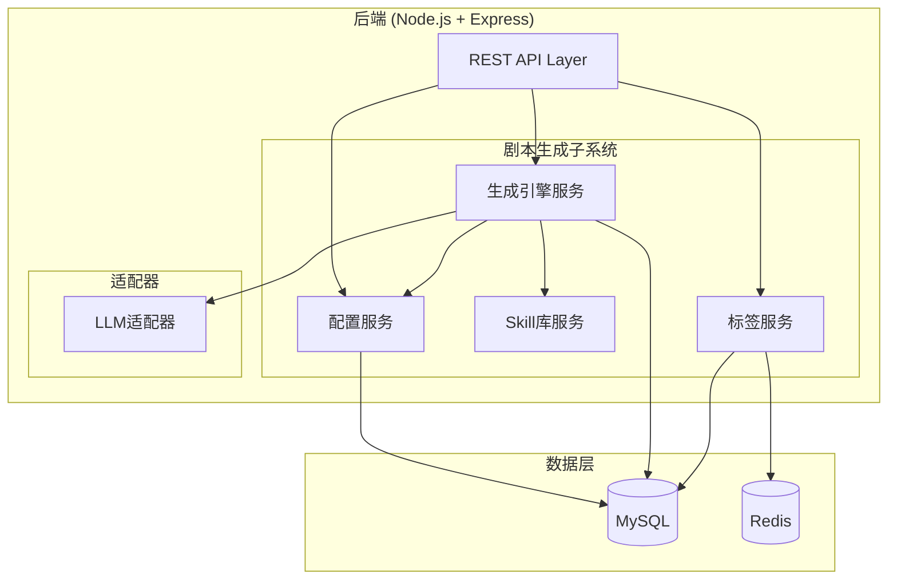
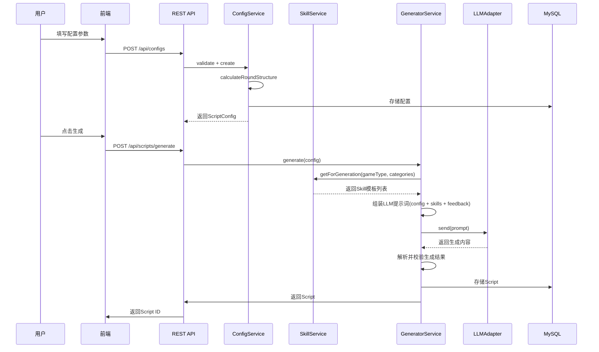

# 设计文档：剧本生成子系统

## 概述

剧本生成子系统是线上剧本杀AI生成工具的核心模块，负责将用户配置参数转化为完整的剧本杀内容。系统采用全栈TypeScript技术栈，Monorepo结构（packages/shared、packages/server、packages/client）。

核心设计决策：
1. **参数驱动生成**：用户通过ConfigService配置参数，系统自动计算轮次结构，驱动Generator生成完整剧本
2. **Skill模板辅助**：按游戏类型从JSON文件加载预定义Skill模板，注入LLM提示词提升生成质量
3. **LLM适配器模式**：统一接口适配多种LLM提供商，支持指数退避重试
4. **分支叙事引擎**：生成包含多分支节点和多结局的剧本结构，通过投票驱动剧情走向
5. **标签自动生成**：根据配置参数自动为剧本打标签，支持自定义标签和组合检索
6. **反馈闭环优化**：利用玩家评价数据驱动后续生成优化，支持自动触发和手动触发
7. **版本不可变**：剧本优化创建新版本，原版本保留不变

技术栈：
- 后端：Node.js + Express + TypeScript
- 数据库：MySQL + Redis
- 测试：Vitest + fast-check（属性测试）
- 部署：Docker + Docker Compose

> 注：本子系统仅包含后端服务层和REST API，不包含独立前端实现。

## 架构

### 子系统架构图



> 注：本子系统仅包含后端服务和REST API，不包含独立前端。前端由其他子系统统一提供。

### 生成流程



## 组件与接口

### 1. 配置服务 (ConfigService)

负责剧本生成参数的校验、轮次结构自动适配和配置对象管理。已在子模块中实现（`packages/server/src/services/config.service.ts`）。

```typescript
// packages/shared/src/types/config.ts（已定义）
enum GameType { HONKAKU, SHIN_HONKAKU, HENKAKU }
enum AgeGroup { ELEMENTARY, MIDDLE_SCHOOL, COLLEGE, ADULT }

interface ScriptConfig {
  id: string;
  playerCount: number;        // 1-6
  durationHours: number;      // 2-6
  gameType: GameType;
  ageGroup: AgeGroup;
  restorationRatio: number;   // 0-100
  deductionRatio: number;     // 0-100, 与还原比例之和=100
  era: string;
  location: string;
  theme: string;
  language: string;           // 默认 'zh'
  roundStructure: RoundStructure; // 自动计算
}

interface IConfigService {
  validate(input: unknown): ValidationResult;
  create(input: CreateConfigInput): Promise<ScriptConfig>;
  calculateRoundStructure(durationHours: number): RoundStructure;
  getById(id: string): Promise<ScriptConfig | null>;
}
```

**轮次自动适配规则**：
| 时长 | 轮次 | 总结时间 |
|------|------|----------|
| 2小时 | 2轮 | 20分钟 |
| 3小时 | 3轮 | 30分钟 |
| 4小时 | 4轮 | 30分钟 |
| 5小时 | 4轮 | 40分钟 |
| 6小时 | 5轮 | 40分钟 |

每轮阶段时间：阅读10-15分钟、搜证15-20分钟、讨论15-20分钟。

### 2. Skill库服务 (SkillService)

管理预定义的剧本杀Skill模板，按游戏类型提供对应模板。已在子模块中实现（`packages/server/src/services/skill.service.ts`）。

```typescript
// packages/shared/src/types/script.ts（已定义）
enum SkillCategory {
  CHARACTER_DESIGN, CLUE_DESIGN, TIMELINE,
  MOTIVE, TRICK, RESTORATION, DEDUCTION_CHAIN
}

interface SkillTemplate {
  id: string;
  category: SkillCategory;
  name: string;
  description: string;
  gameTypes: GameType[];
  priority: number;
  content: string;             // Prompt片段
}

interface ISkillService {
  getByCategory(category: SkillCategory): Promise<SkillTemplate[]>;
  getByGameType(gameType: GameType): Promise<SkillTemplate[]>;
  getForGeneration(gameType: GameType, categories: SkillCategory[]): Promise<SkillTemplate[]>;
  serialize(template: SkillTemplate): string;
  deserialize(json: string): SkillTemplate;
  getAllTemplates(): SkillTemplate[];
}
```

Skill模板数据存储在JSON文件中（`packages/server/src/skills/`目录下按游戏类型分文件：honkaku.json、shin-honkaku.json、henkaku.json、common.json）。

### 3. LLM适配器 (LLMAdapter)

与大语言模型API交互的适配层。已在子模块中实现（`packages/server/src/adapters/llm-adapter.ts`）。

```typescript
// packages/shared/src/types/script.ts（已定义）
interface LLMRequest {
  prompt: string;
  systemPrompt?: string;
  maxTokens?: number;
  temperature?: number;
}

interface LLMResponse {
  content: string;
  tokenUsage: { prompt: number; completion: number; total: number };
  responseTimeMs: number;
}

interface ILLMAdapter {
  send(request: LLMRequest): Promise<LLMResponse>;
  getProviderName(): string;
  getDefaultModel(): string;
}

// 重试配置
const LLM_RETRY_CONFIG = {
  maxRetries: 3,
  baseDelayMs: 1000,
  backoffMultiplier: 2
};

// 错误类型
class LLMError extends Error {
  statusCode: number | undefined;
  retryAttempts: number;
  provider: string;
  isRetryable: boolean;
}
```

环境变量配置：`LLM_API_KEY`、`LLM_ENDPOINT`、`LLM_MODEL`、`LLM_PROVIDER`。

### 4. 生成引擎服务 (GeneratorService)

核心AI生成模块，调用LLM结合Skill模板生成完整剧本。需要新实现。

```typescript
interface Script {
  id: string;
  version: string;            // "v1.0"
  configId: string;
  config: ScriptConfig;
  dmHandbook: DMHandbook;
  playerHandbooks: PlayerHandbook[];
  materials: Material[];
  branchStructure: BranchStructure;
  tags: Tag[];
  createdAt: Date;
  updatedAt: Date;
}

interface IGeneratorService {
  generate(config: ScriptConfig): Promise<Script>;
  optimizeWithFeedback(scriptId: string, feedback: AggregatedFeedback): Promise<Script>;
  getScript(id: string): Promise<Script | null>;
  getScriptVersions(scriptId: string): Promise<Script[]>;
  listScripts(filters?: ScriptFilters): Promise<Script[]>;
  serializeScript(script: Script): string;
  deserializeScript(json: string): Script;
}
```

**生成流程**：
1. 从SkillService获取匹配游戏类型的Skill模板
2. 查询历史反馈数据（低分维度、高频建议）
3. 组装LLM提示词（系统提示 + 配置参数 + Skill模板 + 反馈优化指令 + 语言指令）
4. 调用LLMAdapter生成内容
5. 解析LLM返回的JSON结构化内容
6. 校验生成结果（玩家手册数量、线索一致性、分支可达性）
7. 自动生成标签
8. 存储到数据库

### 5. DM手册 (DMHandbook)

```typescript
// packages/shared/src/types/script.ts（已定义）
interface DMHandbook {
  overview: string;
  characters: CharacterSummary[];
  timeline: TimelineEvent[];
  clueDistribution: ClueDistributionEntry[];
  roundGuides: RoundGuide[];
  branchDecisionPoints: BranchDecisionPoint[];
  endings: EndingDescription[];
  truthReveal: string;
  judgingRules: JudgingRules;
}

interface ClueDistributionEntry {
  clueId: string;
  roundIndex: number;
  targetCharacterId: string;
  condition: string;
  timing: string;
}
```

### 6. 玩家手册 (PlayerHandbook)

```typescript
// packages/shared/src/types/script.ts（已定义）
interface PlayerHandbook {
  characterId: string;
  characterName: string;
  backgroundStory: string;
  primaryGoal: string;
  secondaryGoals: string[];
  relationships: CharacterRelationship[];
  knownClues: string[];
  roundActions: RoundAction[];
  secrets: string[];           // 仅该角色可见
}
```

### 7. 游戏物料 (Material)

```typescript
// packages/shared/src/types/script.ts（已定义）
enum MaterialType { CLUE_CARD, PROP_CARD, VOTE_CARD, SCENE_CARD }

interface Material {
  id: string;
  type: MaterialType;
  content: string;
  associatedCharacterId?: string;
  metadata: Record<string, unknown>;
}

interface ClueCard extends Material {
  type: MaterialType.CLUE_CARD;
  clueId: string;
  associatedCharacterId: string;
}
```

### 8. 分支结构 (BranchStructure)

```typescript
// packages/shared/src/types/script.ts（已定义）
interface BranchStructure {
  nodes: BranchNode[];
  edges: BranchEdge[];
  endings: Ending[];
}

interface BranchNode {
  id: string;
  roundIndex: number;
  description: string;
  voteQuestion: string;
  options: VoteOption[];
}

interface VoteOption {
  id: string;
  text: string;
  nextNodeId: string | null;
  endingId: string | null;
}

interface Ending {
  id: string;
  name: string;
  triggerConditions: TriggerCondition[];
  narrative: string;
  playerEndings: PlayerEnding[];
}
```

### 9. 标签服务 (TagService)

```typescript
// packages/shared/src/types/tag.ts（已定义）
enum TagCategory {
  GAME_TYPE, AGE_GROUP, PLAYER_COUNT, ERA, THEME, CUSTOM
}

interface Tag {
  id: string;
  name: string;
  category: TagCategory;
}

interface ScriptTag {
  scriptId: string;
  tagId: string;
  isAutoGenerated: boolean;
}

interface ITagService {
  autoGenerateTags(script: Script): Promise<Tag[]>;
  addCustomTag(scriptId: string, tagName: string): Promise<Tag>;
  removeTag(scriptId: string, tagId: string): Promise<void>;
  getScriptTags(scriptId: string): Promise<Tag[]>;
  searchByTags(tagIds: string[], limit: number, offset: number): Promise<Script[]>;
  getPopularTags(limit: number): Promise<Tag[]>;
}
```

**自动标签生成规则**：
- `game_type`: 从config.gameType映射
- `age_group`: 从config.ageGroup映射
- `player_count`: 从config.playerCount映射（如"4人本"）
- `era`: 从config.era提取
- `theme`: 从config.theme提取

### 10. REST API端点

```
配置:
  POST   /api/configs                - 创建配置（校验 + 自动计算轮次结构）
  GET    /api/configs/:id            - 获取配置

剧本:
  POST   /api/scripts/generate       - 生成剧本（传入configId）
  GET    /api/scripts                - 剧本列表（支持标签筛选）
  GET    /api/scripts/:id            - 获取剧本详情
  GET    /api/scripts/:id/versions   - 获取版本历史
  POST   /api/scripts/:id/optimize   - 手动触发优化

标签:
  GET    /api/tags                   - 获取所有标签（支持按category筛选）
  GET    /api/tags/popular           - 热门标签
  POST   /api/scripts/:id/tags      - 为剧本添加自定义标签
  DELETE /api/scripts/:id/tags/:tagId - 移除标签
```

## 数据模型

### MySQL 表结构

```sql
-- 剧本配置（已在子模块中定义）
CREATE TABLE script_configs (
  id VARCHAR(36) PRIMARY KEY,
  player_count INT NOT NULL,
  duration_hours INT NOT NULL,
  game_type ENUM('honkaku', 'shin_honkaku', 'henkaku') NOT NULL,
  age_group ENUM('elementary', 'middle_school', 'college', 'adult') NOT NULL,
  restoration_ratio INT NOT NULL,
  deduction_ratio INT NOT NULL,
  era VARCHAR(100),
  location VARCHAR(100),
  theme VARCHAR(100),
  language VARCHAR(10) DEFAULT 'zh',
  round_structure JSON NOT NULL,
  created_at TIMESTAMP DEFAULT CURRENT_TIMESTAMP
);

-- 剧本
CREATE TABLE scripts (
  id VARCHAR(36) PRIMARY KEY,
  config_id VARCHAR(36) NOT NULL,
  version VARCHAR(20) NOT NULL DEFAULT 'v1.0',
  parent_version_id VARCHAR(36),
  title VARCHAR(200) NOT NULL,
  content JSON NOT NULL,
  status ENUM('generating', 'ready', 'optimizing') DEFAULT 'generating',
  created_at TIMESTAMP DEFAULT CURRENT_TIMESTAMP,
  updated_at TIMESTAMP DEFAULT CURRENT_TIMESTAMP ON UPDATE CURRENT_TIMESTAMP,
  FOREIGN KEY (config_id) REFERENCES script_configs(id)
);

-- 标签
CREATE TABLE tags (
  id VARCHAR(36) PRIMARY KEY,
  name VARCHAR(50) NOT NULL,
  category ENUM('game_type', 'age_group', 'player_count', 'era', 'theme', 'custom') NOT NULL,
  UNIQUE KEY unique_tag (name, category)
);

-- 剧本-标签关联
CREATE TABLE script_tags (
  script_id VARCHAR(36) NOT NULL,
  tag_id VARCHAR(36) NOT NULL,
  is_auto_generated BOOLEAN DEFAULT TRUE,
  PRIMARY KEY (script_id, tag_id),
  FOREIGN KEY (script_id) REFERENCES scripts(id),
  FOREIGN KEY (tag_id) REFERENCES tags(id)
);
```

### Redis 数据结构

```
# 热门标签缓存
tags:popular               -> Sorted Set { tagId -> usageCount } (TTL: 300s)

# 剧本列表缓存
scripts:list:{filterHash}  -> String JSON (TTL: 60s)
```


## 正确性属性

*正确性属性是系统在所有有效执行中应保持为真的特征或行为——本质上是关于系统应该做什么的形式化陈述。属性作为人类可读规范与机器可验证正确性保证之间的桥梁。*

### Property 1: 配置参数校验完整性
*对于任意*配置输入，如果所有必填字段在合法范围内（playerCount 1-6整数, durationHours 2-6整数, gameType为有效枚举值, ageGroup为有效枚举值, restorationRatio + deductionRatio = 100且各自在0-100范围, era/location/theme为非空字符串），则校验结果为valid=true且errors为空；否则校验结果为valid=false且errors精确指出每个不合法字段及其约束。

**验证需求**: 1.1, 1.2, 1.3, 1.4

### Property 2: 轮次结构时长约束
*对于任意*有效的durationHours D（2-6），calculateRoundStructure(D)生成的轮次结构中：每轮阅读时间在10-15分钟范围内，搜证时间在15-20分钟范围内，讨论时间在15-20分钟范围内；所有轮次阶段时间之和 + finalVoteMinutes + revealMinutes ≤ D × 60分钟。

**验证需求**: 1.7

### Property 3: Skill模板JSON往返一致性
*对于任意*有效的SkillTemplate对象，serialize后再deserialize产生的对象与原始对象在所有字段上等价。即 deserialize(serialize(template)) 深度等于 template。

**验证需求**: 2.7

### Property 4: Skill按游戏类型过滤与优先级排序
*对于任意*游戏类型gameType，getByGameType(gameType)返回的每个模板的gameTypes数组都包含该gameType，且结果按priority降序排列，不遗漏任何匹配的模板。

**验证需求**: 2.3, 2.4, 2.5

### Property 5: 玩家手册数量与配置一致
*对于任意*有效Config（playerCount = N），Generator生成的Script中playerHandbooks.length === N。

**验证需求**: 4.2

### Property 6: 线索分发完整性（跨引用一致性）
*对于任意*Generator生成的Script，DM_Handbook中clueDistribution引用的每个clueId在Material的线索卡中都存在对应条目，反之Material中每张线索卡的clueId在clueDistribution中都有对应引用。

**验证需求**: 5.3

### Property 7: 分支结构可达性
*对于任意*Generator生成的BranchStructure，从第一个节点出发，沿任意投票选项路径前进，都能到达至少一个Ending。不存在无法到达任何结局的死路节点。

**验证需求**: 6.2

### Property 8: 玩家手册信息隔离
*对于任意*同一Script中的两个不同PlayerHandbook A和B，A.secrets中的每个秘密都不出现在B的可见内容（backgroundStory、knownClues、roundActions的文本内容）中。

**验证需求**: 4.3

### Property 9: Script JSON往返一致性
*对于任意*有效的Script对象，serializeScript后再deserializeScript产生的对象与原始Script在语义上等价。

**验证需求**: 6.4

### Property 10: 版本递增不可变性
*对于任意*Script的优化操作，操作完成后原版本的内容和版本号保持不变，新版本的版本号严格大于原版本。

**验证需求**: 6.5

### Property 11: 自动标签生成完整性
*对于任意*生成的Script及其关联Config，autoGenerateTags产生的标签集合包含以下类别的标签：game_type、age_group、player_count、era、theme，且每个标签的isAutoGenerated为true。

**验证需求**: 7.1

### Property 12: 标签搜索正确性
*对于任意*标签ID集合和剧本集合，searchByTags返回的每个剧本都关联了所有指定的标签，且不遗漏任何满足条件的剧本。

**验证需求**: 7.3

### Property 13: LLM指数退避重试
*对于任意*可重试的LLM API错误（429或5xx），LLM_Adapter最多重试3次，每次重试的延迟按指数增长（baseDelay × backoffMultiplier^(attempt-1)）。重试耗尽后抛出包含retryAttempts、provider、statusCode的LLMError。

**验证需求**: 9.3, 9.4

### Property 14: LLM响应包含Token用量
*对于任意*成功的LLM API调用，返回的LLMResponse包含tokenUsage（prompt、completion、total字段）和responseTimeMs，且total = prompt + completion。

**验证需求**: 9.5

### Property 15: 反馈驱动提示词包含低分维度
*对于任意*AggregatedFeedback数据，如果某维度平均评分低于6分，则Generator组装的LLM提示词中包含该维度作为优化重点的指令。

**验证需求**: 8.1, 8.2

### Property 16: 自动优化触发条件
*对于任意*Script的反馈数据，当评价数量 ≥ 阈值（默认5）且任一维度平均评分 < 6时，checkAutoOptimizeTrigger返回true；否则返回false。

**验证需求**: 8.4

## 错误处理

### LLM调用失败
- LLMAdapter实施指数退避重试（最多3次）
- 可重试错误：HTTP 429（限流）、5xx（服务端错误）
- 不可重试错误：4xx（客户端错误，429除外）
- 重试耗尽后抛出LLMError，包含完整错误上下文
- GeneratorService捕获LLMError，返回用户友好的错误信息

### 配置校验失败
- ConfigService.validate返回ValidationResult，包含所有校验错误
- 每个ValidationError包含field、message、constraint
- API层返回400状态码和错误详情

### 生成结果校验失败
- Generator解析LLM返回内容后进行结构校验
- 玩家手册数量不匹配：重新生成或返回错误
- 线索ID不一致：记录警告并尝试修复
- 分支结构存在死路：记录警告并尝试修复

### 数据库操作失败
- 使用事务确保数据一致性
- 失败时回滚并返回500错误

## 测试策略

### 测试框架
- **单元测试**: Vitest
- **属性测试**: fast-check + Vitest
- **API测试**: Supertest

### 双重测试方法

**单元测试**用于：
- 特定示例和边界情况（如durationHours=2时的轮次结构）
- 错误条件（如LLM调用失败时的错误处理）
- 集成点（如ConfigService与数据库的交互）

**属性测试**用于：
- 验证跨所有输入的通用属性
- 每个属性测试至少运行100次迭代
- 每个属性测试通过注释引用设计文档中的属性编号
- 注释格式：**Feature: script-generation, Property {number}: {property_text}**
- 每个正确性属性由一个独立的属性测试实现

### 属性测试库
使用 `fast-check` 库进行属性测试，配合 Vitest 测试框架。

### 测试覆盖重点

| 属性 | 测试类型 | 优先级 |
|------|----------|--------|
| P1: 配置校验完整性 | 属性测试 | 高 |
| P2: 轮次时长约束 | 属性测试 | 高 |
| P3: Skill JSON往返 | 属性测试 | 高 |
| P4: Skill游戏类型过滤 | 属性测试 | 中 |
| P5: 玩家手册数量 | 属性测试 | 高 |
| P6: 线索跨引用一致性 | 属性测试 | 高 |
| P7: 分支可达性 | 属性测试 | 高 |
| P8: 信息隔离 | 属性测试 | 高 |
| P9: Script JSON往返 | 属性测试 | 高 |
| P10: 版本不可变性 | 属性测试 | 中 |
| P11: 自动标签完整性 | 属性测试 | 中 |
| P12: 标签搜索正确性 | 属性测试 | 中 |
| P13: LLM重试 | 属性测试 | 高 |
| P14: Token用量 | 属性测试 | 中 |
| P15: 反馈提示词 | 属性测试 | 中 |
| P16: 自动优化触发 | 属性测试 | 中 |
