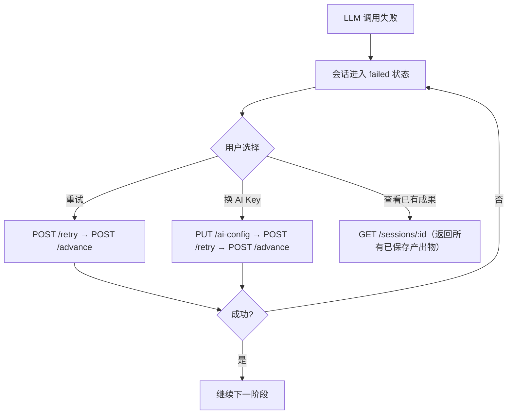
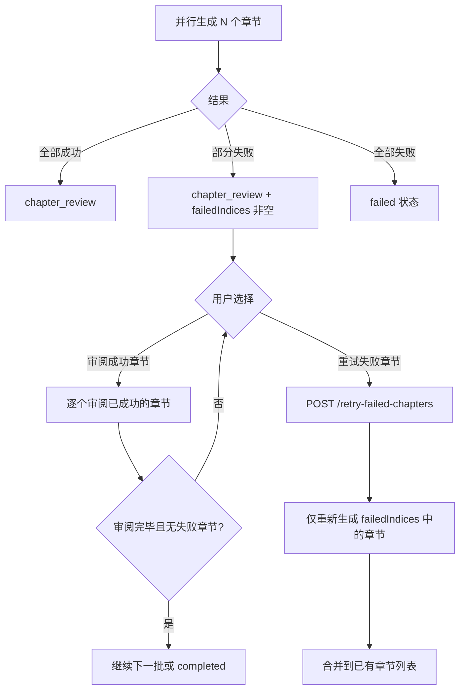
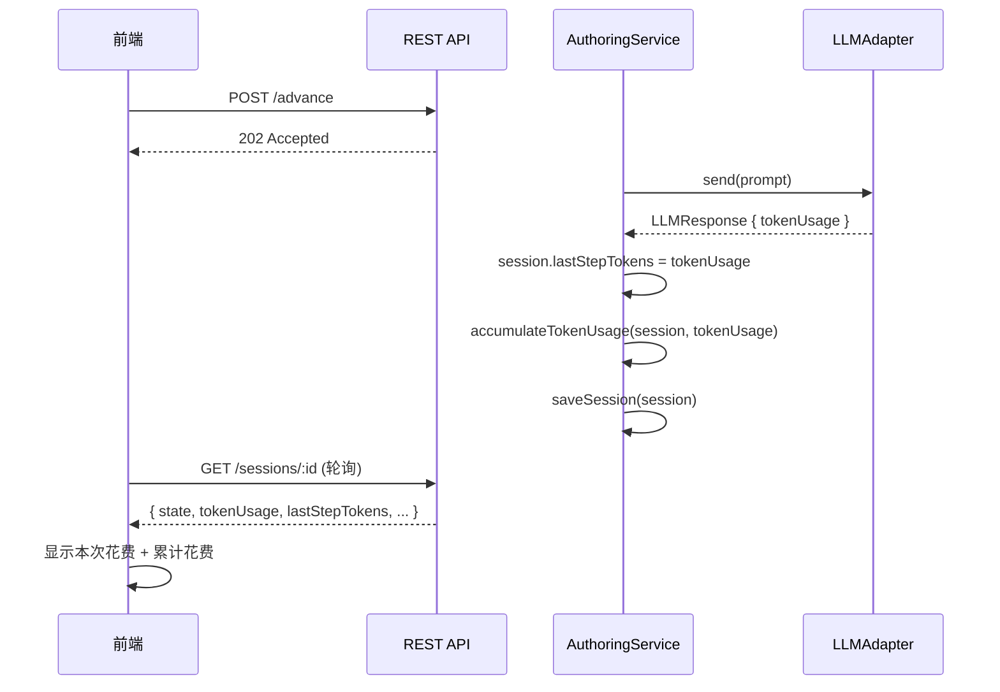

# 设计文档：会话韧性与错误恢复

## 概述

本功能在现有分阶段创作工作流基础上增强错误恢复能力和用户体验。核心改动集中在三个层面：

1. **数据层**：在 `AuthoringSession` 中新增 `lastStepTokens` 字段，记录最近一次 LLM 调用的 token 用量
2. **服务层**：新增 `updateAiConfig` 和 `retryFailedChapters` 两个原子化方法，确保检查点保存语义
3. **API 层**：新增两个端点（`PUT /ai-config`、`POST /retry-failed-chapters`），保持单一职责
4. **UI 层**：编排恢复流程（换 key → retry → advance），显性化 session ID，展示 token 花费

设计原则：
- **接口原子化**：每个 API 只做一件事，复杂编排放 UI
- **检查点语义**：每个 LLM 调用成功后立即 `saveSession`，失败不丢失已有成果
- **向后兼容**：所有新增字段均为可选，不影响现有会话数据

技术栈沿用现有：Node.js + Express + TypeScript，MySQL，Vitest + fast-check。

## 架构

### 错误恢复流程



### 并行批量部分失败恢复



### Token 用量报告流程



## 组件与接口

### 1. AuthoringService 扩展

```typescript
// packages/server/src/services/authoring/authoring.service.ts（修改）

class AuthoringService {
  /**
   * 更换会话的 AI 配置。
   * 仅在 failed 或 review 状态下允许。
   * 创建新的临时适配器替换旧的。
   */
  async updateAiConfig(
    sessionId: string,
    ephemeralAiConfig: EphemeralAiConfig,
  ): Promise<AuthoringSession>;

  /**
   * 仅重试并行批量中失败的章节。
   * 要求会话处于 chapter_review 且 parallelBatch.failedIndices 非空。
   */
  async retryFailedChapters(sessionId: string): Promise<AuthoringSession>;
}
```

### 2. 新增 API 端点

```typescript
// packages/server/src/routes/authoring.ts（修改）

// PUT  /api/authoring-sessions/:id/ai-config           → 更换 AI 配置
// POST /api/authoring-sessions/:id/retry-failed-chapters → 重试失败章节
```

### 3. lastStepTokens 捕获

在每个 LLM 调用点（`advancePlanning`、`approvePlan`、`generateCurrentChapter`、`generateParallelBatch`）成功后，从 `LLMResponse.tokenUsage` 提取并赋值给 `session.lastStepTokens`。

对于并行批量，汇总所有成功调用的 tokenUsage 之和。

## 数据模型

### AuthoringSession 扩展

```typescript
// packages/shared/src/types/authoring.ts（修改）

import type { TokenUsage } from './script';

interface AuthoringSession {
  // ... 现有字段 ...
  lastStepTokens?: TokenUsage;  // 最近一次 LLM 调用的 token 用量
}
```

复用现有的 `TokenUsage` 接口（`{ prompt: number; completion: number; total: number }`），不引入新类型。

### 数据库变更

`authoring_sessions` 表新增列：

```sql
ALTER TABLE authoring_sessions
  ADD COLUMN last_step_tokens JSON DEFAULT NULL;
```

`last_step_tokens` 存储 `{ "prompt": N, "completion": N, "total": N }`。

### AI 配置更换允许的状态集合

```typescript
const AI_CONFIG_UPDATABLE_STATES: SessionState[] = [
  'failed',
  'plan_review',
  'design_review',
  'chapter_review',
  'draft',
];
```

## 正确性属性

### Property 1: lastStepTokens 赋值正确性
*对于任意*成功的 LLM 调用返回的 `TokenUsage { prompt: P, completion: C, total: T }`，调用完成后 `session.lastStepTokens` 等于 `{ prompt: P, completion: C, total: T }`，且 `T = P + C`。

**验证需求: 1.1**

### Property 2: 并行批量 lastStepTokens 为各项之和
*对于任意*并行批量生成中 K 个成功调用各自返回的 `TokenUsage[i]`，批量完成后 `session.lastStepTokens.prompt` 等于 `Σ TokenUsage[i].prompt`，`completion` 和 `total` 同理。

**验证需求: 1.3**

### Property 3: 失败调用不更新 lastStepTokens
*对于任意*会话，当 LLM 调用失败时，`session.lastStepTokens` 保持调用前的值不变。

**验证需求: 1.4**

### Property 4: AI 配置更换状态守卫
*对于任意*会话状态 S，`updateAiConfig` 成功当且仅当 S 在 `AI_CONFIG_UPDATABLE_STATES` 集合中。对于不在集合中的状态，返回错误。

**验证需求: 3.1, 3.3**

### Property 5: 重试保留已有产出物
*对于任意*处于 `failed` 状态的会话，执行 `retry` 后，`planOutput`、`outlineOutput`、`chapters` 中所有非 undefined 的字段保持与 retry 前完全一致。

**验证需求: 5.4**

### Property 6: 失败章节重试后合并正确性
*对于任意*包含 `failedIndices = [i1, i2, ...]` 的并行批量，`retryFailedChapters` 成功后：(a) 之前成功的章节保持不变，(b) 新生成的章节被添加到 `chapters` 列表中，(c) `failedIndices` 被清空。

**验证需求: 4.3, 4.4**

### Property 7: 检查点保存顺序
*对于任意*阶段的 LLM 调用，`saveSession` 在状态转换之前被调用（即产出物先持久化，再转换状态）。这确保了即使状态转换失败，产出物已被保存。

**验证需求: 5.1, 5.2, 5.3**

## 错误处理

| 场景 | 处理方式 | HTTP 状态码 |
|------|---------|------------|
| 更换 AI 配置时会话正在生成中 | 返回 409 Conflict | 409 |
| 更换 AI 配置时会话不存在 | 返回 404 | 404 |
| 更换 AI 配置的 ephemeralAiConfig 校验失败 | 返回 400 | 400 |
| 重试失败章节时无 failedIndices | 返回 400，提示无失败章节 | 400 |
| 重试失败章节时会话不在 chapter_review | 返回 400 | 400 |
| 重试失败章节全部再次失败 | 会话转 failed，保留之前成功的章节 | 200（会话状态为 failed） |

## 测试策略

### 测试框架
- 单元测试：Vitest
- 属性测试：fast-check + Vitest
- API 测试：Supertest

### 双重测试方法

**单元测试**用于：
- `PUT /ai-config` 端点的状态守卫（各状态下的 200/409/400/404）
- `POST /retry-failed-chapters` 端点的前置条件校验
- `lastStepTokens` 在各阶段 LLM 调用后的赋值
- 检查点保存顺序（mock `saveSession` 验证调用时机）
- UI 的 session ID 复制和恢复流程

**属性测试**用于：
- 验证跨所有输入的通用属性
- 每个属性测试至少运行 100 次迭代
- 注释格式：**Feature: session-resilience, Property {number}: {property_text}**

### 属性测试库
使用 `fast-check` 库进行属性测试，配合 Vitest 测试框架。

### 测试覆盖重点

| 属性 | 测试类型 | 优先级 |
|------|----------|--------|
| P1: lastStepTokens 赋值正确性 | 属性测试 | 高 |
| P2: 并行批量 lastStepTokens 为各项之和 | 属性测试 | 高 |
| P3: 失败调用不更新 lastStepTokens | 属性测试 | 中 |
| P4: AI 配置更换状态守卫 | 属性测试 | 高 |
| P5: 重试保留已有产出物 | 属性测试 | 高 |
| P6: 失败章节重试后合并正确性 | 属性测试 | 高 |
| P7: 检查点保存顺序 | 单元测试 | 中 |
