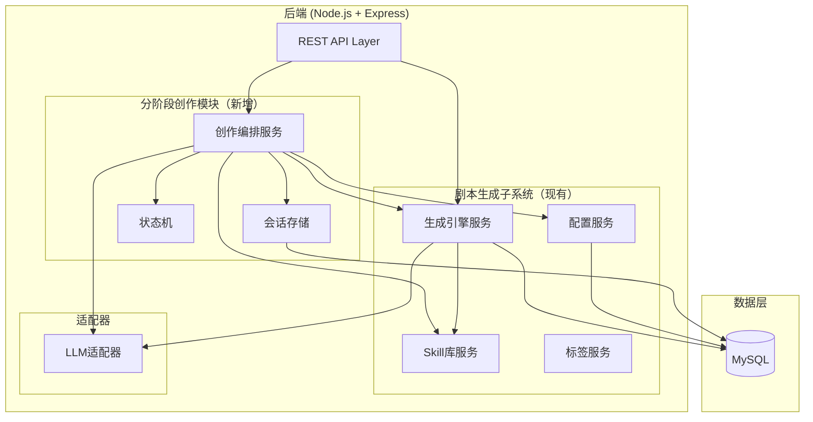
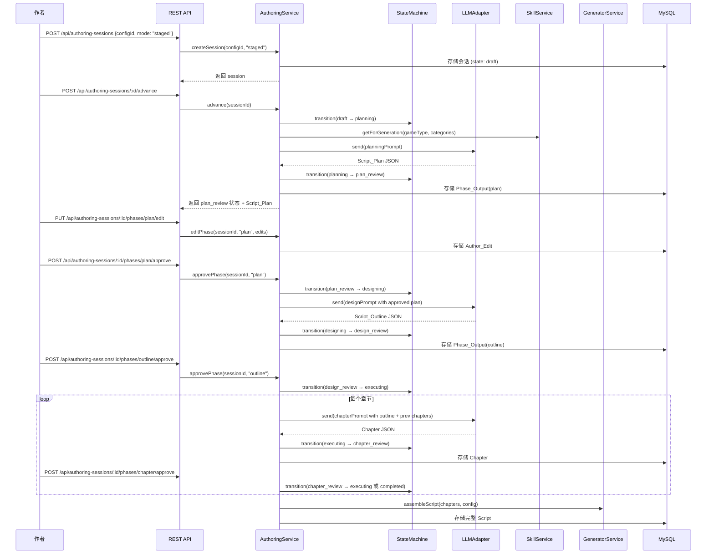
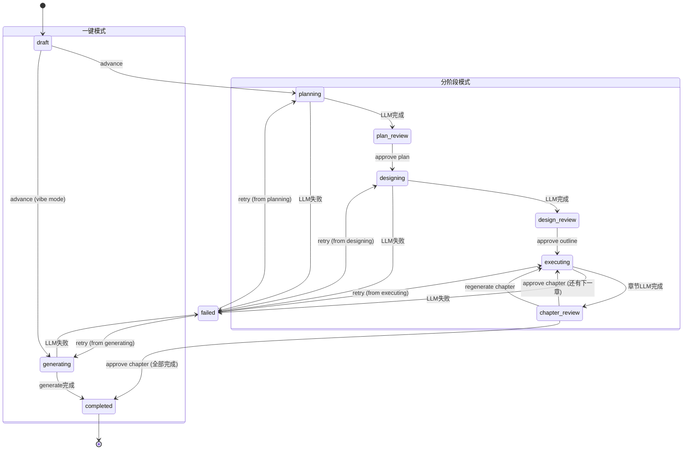

# 设计文档：分阶段剧本创作工作流

## 概述

本功能在现有剧本生成子系统基础上新增分阶段创作工作流（Staged Authoring）。核心思路是将一次性生成拆分为三个可审阅的阶段，同时保留一键生成作为快速模式。

核心设计决策：
1. **会话驱动**：引入 Authoring_Session 实体管理创作生命周期，每个会话关联一个 Config 和一种模式
2. **状态机控制**：严格的状态转换规则确保流程有序，分阶段模式和一键模式各有独立路径
3. **扩展而非替换**：新增 `AuthoringService` 编排分阶段流程，复用现有 `GeneratorService.generate()` 作为一键模式实现，复用 `SkillService` 和 `LLMAdapter`
4. **阶段产出物独立存储**：每个阶段的 LLM 原始输出和作者编辑分别存储为 JSON 文档，支持回溯
5. **章节粒度控制**：生成阶段按章节（DM手册、各玩家手册、物料、分支结构）逐个生成，每个章节可独立审阅和重新生成
6. **最终组装兼容**：所有章节批准后组装为标准 Script 对象，与现有 `generate()` 输出格式完全一致

技术栈沿用现有：Node.js + Express + TypeScript，MySQL + Redis，Vitest + fast-check。

## 架构

### 扩展后的架构图



### 分阶段创作流程



### 状态机图



## 组件与接口

### 1. 状态机 (SessionStateMachine)

纯函数实现，不依赖外部状态。负责校验状态转换合法性。

```typescript
// packages/server/src/services/authoring/state-machine.ts

type SessionState =
  | 'draft' | 'planning' | 'plan_review'
  | 'designing' | 'design_review'
  | 'executing' | 'chapter_review'
  | 'completed' | 'generating' | 'failed';

type AuthoringMode = 'staged' | 'vibe';

interface StateTransitionResult {
  success: boolean;
  newState?: SessionState;
  error?: string;
}

// 合法转换表
const STAGED_TRANSITIONS: Record<string, SessionState[]> = {
  draft: ['planning'],
  planning: ['plan_review', 'failed'],
  plan_review: ['designing'],
  designing: ['design_review', 'failed'],
  design_review: ['executing'],
  executing: ['chapter_review', 'failed'],
  chapter_review: ['executing', 'completed'],
};

const VIBE_TRANSITIONS: Record<string, SessionState[]> = {
  draft: ['generating'],
  generating: ['completed', 'failed'],
};

function transition(
  currentState: SessionState,
  targetState: SessionState,
  mode: AuthoringMode
): StateTransitionResult;
```

### 2. 创作编排服务 (AuthoringService)

核心编排层，协调状态机、LLM调用、存储和现有服务。

```typescript
// packages/server/src/services/authoring/authoring.service.ts

interface IAuthoringService {
  // 会话管理
  createSession(configId: string, mode: AuthoringMode): Promise<AuthoringSession>;
  getSession(sessionId: string): Promise<AuthoringSession | null>;
  listSessions(filters?: SessionFilters): Promise<AuthoringSession[]>;

  // 流程驱动
  advance(sessionId: string): Promise<AuthoringSession>;
  editPhase(sessionId: string, phase: PhaseName, content: unknown): Promise<AuthoringSession>;
  approvePhase(sessionId: string, phase: PhaseName, notes?: string): Promise<AuthoringSession>;
  regenerateChapter(sessionId: string, chapterIndex: number): Promise<AuthoringSession>;
  retry(sessionId: string): Promise<AuthoringSession>;
}

class AuthoringService implements IAuthoringService {
  constructor(
    private llmAdapter: ILLMAdapter,
    private skillService: SkillService,
    private generatorService: GeneratorService,
    private configService: ConfigService,
  ) {}
}
```

### 3. 提示词构建器 (PromptBuilder)

为每个阶段构建专用的 LLM 提示词。独立模块便于测试。

```typescript
// packages/server/src/services/authoring/prompt-builder.ts

interface IPromptBuilder {
  buildPlanningPrompt(config: ScriptConfig, skills: SkillTemplate[]): LLMRequest;
  buildDesignPrompt(
    config: ScriptConfig,
    approvedPlan: ScriptPlan,
    skills: SkillTemplate[],
    authorNotes?: string
  ): LLMRequest;
  buildChapterPrompt(
    config: ScriptConfig,
    approvedOutline: ScriptOutline,
    chapterType: ChapterType,
    chapterIndex: number,
    previousChapters: Chapter[],
  ): LLMRequest;
}
```

### 4. 阶段产出物解析器 (PhaseParser)

解析和校验每个阶段的 LLM 输出。

```typescript
// packages/server/src/services/authoring/phase-parser.ts

interface IPhaseParser {
  parsePlan(content: string): ScriptPlan;
  parseOutline(content: string): ScriptOutline;
  parseChapter(content: string, chapterType: ChapterType): Chapter;
}
```

## 数据模型

### 新增 TypeScript 类型

```typescript
// packages/shared/src/types/authoring.ts

/** 创作模式 */
type AuthoringMode = 'staged' | 'vibe';

/** 会话状态 */
type SessionState =
  | 'draft' | 'planning' | 'plan_review'
  | 'designing' | 'design_review'
  | 'executing' | 'chapter_review'
  | 'completed' | 'generating' | 'failed';

/** 阶段名称 */
type PhaseName = 'plan' | 'outline' | 'chapter';

/** 章节类型 */
type ChapterType = 'dm_handbook' | 'player_handbook' | 'materials' | 'branch_structure';

/** 企划书 */
interface ScriptPlan {
  worldOverview: string;
  characters: {
    name: string;
    role: string;
    relationshipSketch: string;
  }[];
  coreTrickDirection: string;
  themeTone: string;
  eraAtmosphere: string;
}

/** 剧本大纲 */
interface ScriptOutline {
  detailedTimeline: {
    time: string;
    event: string;
    involvedCharacters: string[];
  }[];
  characterRelationships: {
    characterA: string;
    characterB: string;
    relationship: string;
  }[];
  trickMechanism: string;
  clueChainDesign: {
    clueId: string;
    description: string;
    leadsTo: string[];
  }[];
  branchSkeleton: {
    nodeId: string;
    description: string;
    options: string[];
    endingDirections: string[];
  }[];
  roundFlowSummary: {
    roundIndex: number;
    focus: string;
    keyEvents: string[];
  }[];
}

/** 章节 */
interface Chapter {
  index: number;
  type: ChapterType;
  characterId?: string;       // 仅 player_handbook 类型
  content: unknown;           // DMHandbook | PlayerHandbook | Material[] | BranchStructure
  generatedAt: Date;
}

/** 作者编辑记录 */
interface AuthorEdit {
  editedAt: Date;
  originalContent: unknown;
  editedContent: unknown;
}

/** 阶段产出物 */
interface PhaseOutput {
  phase: PhaseName;
  llmOriginal: unknown;       // LLM 原始生成内容
  authorEdited?: unknown;     // 作者编辑后版本（若有编辑）
  authorNotes?: string;       // 作者附加备注
  edits: AuthorEdit[];        // 编辑历史
  approved: boolean;
  approvedAt?: Date;
  generatedAt: Date;
}

/** 会话筛选条件 */
interface SessionFilters {
  configId?: string;
  state?: SessionState;
  mode?: AuthoringMode;
  limit?: number;
  offset?: number;
}

/** 失败信息 */
interface FailureInfo {
  phase: PhaseName | 'generating';
  error: string;
  failedAt: Date;
  retryFromState: SessionState;
}

/** 创作会话 */
interface AuthoringSession {
  id: string;
  configId: string;
  mode: AuthoringMode;
  state: SessionState;
  planOutput?: PhaseOutput;
  outlineOutput?: PhaseOutput;
  chapters: Chapter[];
  chapterEdits: Record<number, AuthorEdit[]>;
  currentChapterIndex: number;
  totalChapters: number;
  scriptId?: string;          // 完成后关联的 Script ID
  failureInfo?: FailureInfo;
  createdAt: Date;
  updatedAt: Date;
}
```

### 新增 MySQL 表

```sql
-- 002-authoring-sessions.sql

CREATE TABLE IF NOT EXISTS authoring_sessions (
  id VARCHAR(36) PRIMARY KEY,
  config_id VARCHAR(36) NOT NULL,
  mode ENUM('staged', 'vibe') NOT NULL,
  state ENUM(
    'draft', 'planning', 'plan_review',
    'designing', 'design_review',
    'executing', 'chapter_review',
    'completed', 'generating', 'failed'
  ) NOT NULL DEFAULT 'draft',
  plan_output JSON,
  outline_output JSON,
  chapters JSON,
  chapter_edits JSON,
  current_chapter_index INT DEFAULT 0,
  total_chapters INT DEFAULT 0,
  script_id VARCHAR(36),
  failure_info JSON,
  created_at TIMESTAMP DEFAULT CURRENT_TIMESTAMP,
  updated_at TIMESTAMP DEFAULT CURRENT_TIMESTAMP ON UPDATE CURRENT_TIMESTAMP,
  FOREIGN KEY (config_id) REFERENCES script_configs(id),
  FOREIGN KEY (script_id) REFERENCES scripts(id)
);

CREATE INDEX idx_sessions_config ON authoring_sessions(config_id);
CREATE INDEX idx_sessions_state ON authoring_sessions(state);
```

### 章节生成顺序

对于 playerCount = N 的配置，总章节数 = N + 3：

| 章节索引 | 类型 | 内容 |
|----------|------|------|
| 0 | dm_handbook | DM手册 |
| 1..N | player_handbook | 玩家手册（每个玩家一个） |
| N+1 | materials | 游戏物料集 |
| N+2 | branch_structure | 分支结构详情 |


## 正确性属性

*正确性属性是系统在所有有效执行中应保持为真的特征或行为——本质上是关于系统应该做什么的形式化陈述。属性作为人类可读规范与机器可验证正确性保证之间的桥梁。*

### Property 1: 创作数据往返一致性
*对于任意*有效的 AuthoringSession、PhaseOutput 或 AuthorEdit 对象，将其序列化为 JSON 后再反序列化，产生的对象与原始对象在所有字段上深度等价。即 `deserialize(serialize(obj))` 深度等于 `obj`。

**验证需求: 1.2, 1.4, 1.6, 7.4, 7.5**

### Property 2: 状态机转换正确性
*对于任意*会话状态 S、目标状态 T 和创作模式 M（staged 或 vibe），`transition(S, T, M)` 成功当且仅当 (S, T) 在该模式的合法转换表中。对于不在合法转换表中的 (S, T) 组合，`transition` 返回包含当前状态 S 和目标状态 T 的错误信息。

**验证需求: 2.2, 2.3, 2.4**

### Property 3: 失败与重试状态恢复
*对于任意*处于 LLM 调用阶段（planning、designing、executing、generating）的会话，当 LLM 调用失败时，会话状态转换为 `failed` 且 failureInfo 包含失败阶段和错误信息。对于任意处于 `failed` 状态的会话，重试操作将状态恢复到 `failureInfo.retryFromState` 指定的阶段起始状态。

**验证需求: 2.5, 2.6**

### Property 4: Script_Plan 结构完整性
*对于任意*有效的 Script_Plan JSON 字符串，解析后的 ScriptPlan 对象包含非空的 worldOverview、至少一个角色概念（含 name、role、relationshipSketch）、非空的 coreTrickDirection、非空的 themeTone 和非空的 eraAtmosphere。

**验证需求: 3.2**

### Property 5: Script_Outline 结构完整性
*对于任意*有效的 Script_Outline JSON 字符串，解析后的 ScriptOutline 对象包含非空的 detailedTimeline、非空的 characterRelationships、非空的 trickMechanism、非空的 clueChainDesign、非空的 branchSkeleton 和非空的 roundFlowSummary。

**验证需求: 4.2**

### Property 6: 作者备注传播到提示词
*对于任意*包含作者备注的已批准 Script_Plan，`buildDesignPrompt` 生成的提示词文本中包含该备注内容。

**验证需求: 4.6**

### Property 7: 编辑记录保留双版本
*对于任意*阶段编辑操作，生成的 AuthorEdit 记录同时包含 LLM 原始生成内容（originalContent）和作者修改后的内容（editedContent），且 originalContent 与编辑前的 Phase_Output.llmOriginal 一致。

**验证需求: 3.4, 4.4, 5.5, 7.2**

### Property 8: 章节数量与排序
*对于任意*有效 Config（playerCount = N），生成阶段的总章节数为 N + 3，章节按以下顺序排列：索引 0 为 dm_handbook，索引 1..N 为 player_handbook，索引 N+1 为 materials，索引 N+2 为 branch_structure。

**验证需求: 5.1**

### Property 9: 章节进度状态逻辑
*对于任意*处于 `chapter_review` 状态的会话，批准当前章节后：若 currentChapterIndex < totalChapters - 1，则状态转换为 `executing`；若 currentChapterIndex = totalChapters - 1，则状态转换为 `completed`。

**验证需求: 5.3**

### Property 10: 章节重新生成保留历史
*对于任意*章节重新生成操作，操作完成后该章节的编辑历史中保留了之前的生成版本，且新生成的内容替换为当前版本。

**验证需求: 5.4**

### Property 11: 章节组装为完整 Script
*对于任意*所有章节均已批准的会话，组装产生的 Script 对象包含：来自 dm_handbook 章节的 DMHandbook、来自 player_handbook 章节的 PlayerHandbook 数组（长度等于 playerCount）、来自 materials 章节的 Material 数组、来自 branch_structure 章节的 BranchStructure。

**验证需求: 5.6**

### Property 12: 章节提示词包含前序内容
*对于任意*索引为 K（K > 0）的章节，`buildChapterPrompt` 生成的提示词中包含索引 0 到 K-1 的已批准章节内容。

**验证需求: 5.7**

### Property 13: 模式无关的 Script 输出格式
*对于任意*已完成的 AuthoringSession，无论其模式为 staged 还是 vibe，关联的 Script 对象结构与现有 `GeneratorService.generate()` 的输出类型一致（包含 id、configId、dmHandbook、playerHandbooks、materials、branchStructure 等必要字段）。

**验证需求: 6.4**

### Property 14: 会话列表筛选正确性
*对于任意*会话集合和筛选条件（configId、state），返回的列表中每个会话都满足所有指定的筛选条件，且不遗漏任何满足条件的会话。

**验证需求: 1.3**

### Property 15: 状态变更时间戳更新
*对于任意*会话状态转换操作，操作完成后会话的 updatedAt 时间戳严格晚于操作前的 updatedAt。

**验证需求: 1.5**

## 错误处理

### LLM 调用失败
- 各阶段（planning、designing、executing）的 LLM 调用失败时，AuthoringService 捕获 LLMError
- 会话状态转换为 `failed`，failureInfo 记录失败阶段、错误信息和可重试的起始状态
- 作者可通过 retry 端点重试，状态回退到失败前的阶段起始状态
- 一键模式的 LLM 失败同样转换为 `failed`，重试从 `generating` 重新开始

### 阶段产出物解析失败
- PhaseParser 解析 LLM 返回内容失败时（非法 JSON 或缺少必要字段），视为 LLM 调用失败处理
- 记录原始 LLM 返回内容用于调试

### 非法状态转换
- StateMachine 拒绝不合法的转换请求
- 返回 400 错误，包含当前状态和请求的目标状态

### 会话不存在
- 查询不存在的会话 ID 返回 404
- 对不存在的会话执行操作返回 404

### 配置不存在
- 创建会话时引用不存在的 configId 返回 404

## 测试策略

### 测试框架
- **单元测试**: Vitest
- **属性测试**: fast-check + Vitest
- **API 测试**: Supertest

### 双重测试方法

**单元测试**用于：
- API 端点的请求/响应验证（8.1-8.8）
- 特定状态转换场景（如 draft → planning 的具体行为）
- LLM 调用失败时的错误处理流程
- 章节生成的集成流程

**属性测试**用于：
- 验证跨所有输入的通用属性
- 每个属性测试至少运行 100 次迭代
- 每个属性测试通过注释引用设计文档中的属性编号
- 注释格式：**Feature: staged-authoring, Property {number}: {property_text}**
- 每个正确性属性由一个独立的属性测试实现

### 属性测试库
使用 `fast-check` 库进行属性测试，配合 Vitest 测试框架。

### 测试覆盖重点

| 属性 | 测试类型 | 优先级 |
|------|----------|--------|
| P1: 创作数据往返一致性 | 属性测试 | 高 |
| P2: 状态机转换正确性 | 属性测试 | 高 |
| P3: 失败与重试状态恢复 | 属性测试 | 高 |
| P4: Script_Plan 结构完整性 | 属性测试 | 中 |
| P5: Script_Outline 结构完整性 | 属性测试 | 中 |
| P6: 作者备注传播到提示词 | 属性测试 | 中 |
| P7: 编辑记录保留双版本 | 属性测试 | 高 |
| P8: 章节数量与排序 | 属性测试 | 高 |
| P9: 章节进度状态逻辑 | 属性测试 | 高 |
| P10: 章节重新生成保留历史 | 属性测试 | 中 |
| P11: 章节组装为完整 Script | 属性测试 | 高 |
| P12: 章节提示词包含前序内容 | 属性测试 | 中 |
| P13: 模式无关的 Script 输出格式 | 属性测试 | 中 |
| P14: 会话列表筛选正确性 | 属性测试 | 中 |
| P15: 状态变更时间戳更新 | 属性测试 | 中 |
