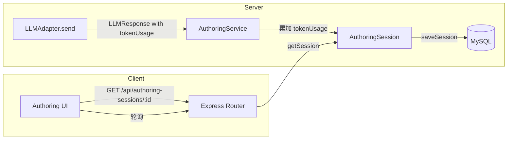

# 设计文档：Token 用量追踪

## 概述

本功能在现有创作工作流中增加 Token 用量追踪能力。核心思路是：在 `AuthoringSession` 类型中新增 `tokenUsage` 字段，在 `AuthoringService` 每次 LLM 调用后累加 Token 数据，通过现有的会话 API 自动暴露给前端，并在测试 UI 中展示。

设计原则：最小侵入性修改，复用现有数据流（轮询机制、会话持久化），不引入新的 API 端点。

## 架构



数据流：
1. `LLMAdapter.send()` 返回 `LLMResponse`（已包含 `tokenUsage`）
2. `AuthoringService` 中每个调用 LLM 的方法在收到响应后，调用累加函数更新 `session.tokenUsage`
3. `saveSession()` 将包含 `tokenUsage` 的完整会话写入数据库
4. UI 通过现有轮询机制 `GET /api/authoring-sessions/:id` 获取最新数据并渲染

## 组件与接口

### 1. CumulativeTokenUsage 类型（shared 包）

在 `packages/shared/src/types/authoring.ts` 中新增：

```typescript
/** 会话级累计 Token 用量 */
export interface CumulativeTokenUsage {
  promptTokens: number;
  completionTokens: number;
  totalTokens: number;
  callCount: number;
}
```

### 2. AuthoringSession 类型扩展

在 `AuthoringSession` 接口中新增字段：

```typescript
export interface AuthoringSession {
  // ... 现有字段
  tokenUsage?: CumulativeTokenUsage;  // 累计 Token 用量
}
```

使用可选字段以保持向后兼容。

### 3. Token 累加工具函数

在 `AuthoringService` 中新增私有方法：

```typescript
private accumulateTokenUsage(session: AuthoringSession, usage: TokenUsage): void {
  if (!session.tokenUsage) {
    session.tokenUsage = { promptTokens: 0, completionTokens: 0, totalTokens: 0, callCount: 0 };
  }
  session.tokenUsage.promptTokens += usage.prompt;
  session.tokenUsage.completionTokens += usage.completion;
  session.tokenUsage.totalTokens += usage.total;
  session.tokenUsage.callCount += 1;
}
```

### 4. AuthoringService 修改点

需要在以下方法中，每次 `adapter.send()` 成功返回后调用 `accumulateTokenUsage`：

| 方法 | 调用位置 |
|------|---------|
| `advancePlanning` | `response = await adapter.send(request)` 之后 |
| `advanceExecuting` | `response = await adapter.send(request)` 之后 |
| `approvePlan` (→ designing) | `response = await adapter.send(request)` 之后 |
| `generateCurrentChapter` | `response = await adapter.send(request)` 之后 |
| `generateParallelBatch` | 每个并行 Promise 中 `response = await adapter.send(request)` 之后 |

对于 `generateParallelBatch`，由于多个 Promise 并行执行，需要在所有 Promise 完成后统一累加（在 `Promise.allSettled` 结果处理中），避免并发写入问题。

### 5. 数据库持久化

`saveSession()` 已经将整个 session 对象序列化存储。`tokenUsage` 作为 session 的一个字段，会随 `saveSession()` 自动持久化，无需额外修改数据库 schema（假设 session 以 JSON 列存储）。

如果 session 使用独立列存储，需要在 `authoring_sessions` 表中新增 `token_usage` JSON 列，并在 `insertSession`、`saveSession`、`rowToSession` 中处理该字段。

### 6. UI 展示组件

在测试 UI 的 HTML 中新增 Token 用量展示区域，放置在导航栏或步骤条下方：

```html
<div id="token-stats" style="display:none">
  <span>Prompt: <span id="tk-prompt">0</span></span>
  <span>Completion: <span id="tk-completion">0</span></span>
  <span>Total: <span id="tk-total">0</span></span>
  <span>调用: <span id="tk-calls">0</span>次</span>
</div>
```

在现有的 `hu(s)` 轮询回调中，读取 `s.tokenUsage` 并更新 DOM 元素。

## 数据模型

### CumulativeTokenUsage

| 字段 | 类型 | 说明 |
|------|------|------|
| promptTokens | number | 累计 prompt token 数 |
| completionTokens | number | 累计 completion token 数 |
| totalTokens | number | 累计 total token 数 |
| callCount | number | LLM 调用次数 |

不变量：`totalTokens === promptTokens + completionTokens`（当每次 LLM 返回的 `total === prompt + completion` 时成立）

### 初始状态

新建会话时，`tokenUsage` 初始化为 `{ promptTokens: 0, completionTokens: 0, totalTokens: 0, callCount: 0 }`。


## 正确性属性

*正确性属性是一种在系统所有有效执行中都应成立的特征或行为——本质上是关于系统应该做什么的形式化陈述。属性是人类可读规范与机器可验证正确性保证之间的桥梁。*

### Property 1: 累加正确性

*For any* 有效的 TokenUsage 值序列，将它们依次累加到一个初始为零的 CumulativeTokenUsage 后，promptTokens 应等于所有单次 prompt 值之和，completionTokens 应等于所有单次 completion 值之和，totalTokens 应等于所有单次 total 值之和，callCount 应等于序列长度。

**Validates: Requirements 1.1, 1.2, 1.3, 4.1, 4.2, 4.3**

### Property 2: totalTokens 不变量

*For any* CumulativeTokenUsage 状态（经过任意次累加操作后），当每次输入的 TokenUsage 满足 `total === prompt + completion` 时，累计的 totalTokens 应始终等于 promptTokens + completionTokens。

**Validates: Requirements 4.4**

### Property 3: 失败调用不影响累计

*For any* 混合成功与失败的 LLM 调用序列，累计的 Token 用量应仅反映成功调用的数据，callCount 应仅计入成功调用的次数。

**Validates: Requirements 4.5**

### Property 4: 持久化往返一致性

*For any* 包含 tokenUsage 数据的 AuthoringSession，保存到数据库后再读取，tokenUsage 中的所有字段值应与保存前完全一致。

**Validates: Requirements 2.3**

## 错误处理

| 场景 | 处理方式 |
|------|---------|
| LLM 调用失败（抛出异常） | 不累加 Token 用量，保持当前累计值不变。失败信息记录在 `failureInfo` 中（现有逻辑） |
| LLM 返回 tokenUsage 字段缺失或为零 | 正常累加（加零不影响结果），callCount 仍递增 |
| 并行生成中部分章节失败 | 仅累加成功章节的 Token 用量，失败章节不计入 |
| 数据库读取时 tokenUsage 字段缺失（旧数据） | 返回 undefined 或默认零值，UI 显示为 0 |

## 测试策略

### 属性测试（Property-Based Testing）

使用 `fast-check` 库（已在项目中可用或易于添加到 Vitest 环境）。

每个属性测试至少运行 100 次迭代。

- **Property 1 测试**：生成随机长度的 `TokenUsage[]` 数组，逐个累加后验证总和
  - Tag: **Feature: token-usage-tracking, Property 1: 累加正确性**
- **Property 2 测试**：生成随机 `TokenUsage[]`（确保每个 `total = prompt + completion`），累加后验证不变量
  - Tag: **Feature: token-usage-tracking, Property 2: totalTokens 不变量**
- **Property 3 测试**：生成混合成功/失败标记的调用序列，验证仅成功调用被累计
  - Tag: **Feature: token-usage-tracking, Property 3: 失败调用不影响累计**
- **Property 4 测试**：生成随机 CumulativeTokenUsage，序列化为 JSON 再反序列化，验证一致性
  - Tag: **Feature: token-usage-tracking, Property 4: 持久化往返一致性**

### 单元测试

- 验证 `accumulateTokenUsage` 对空会话（无 tokenUsage 字段）的初始化行为
- 验证 API 响应中包含 tokenUsage 字段
- 验证 UI 中 Token 展示元素的存在（DOM 结构测试）

### 测试框架

- 测试运行器：Vitest（项目已使用）
- 属性测试库：fast-check
- 每个属性测试必须以注释引用设计文档中的属性编号
